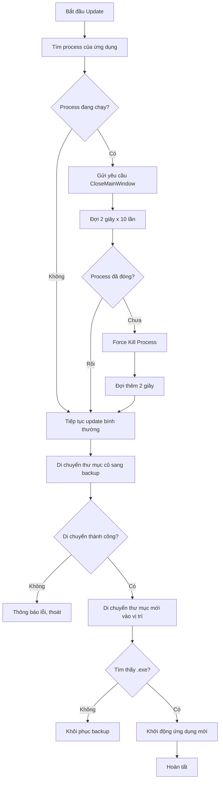

# Kế hoạch sửa lỗi: Ứng dụng đang chạy (In Use) khi cập nhật

## ✅ Giải pháp được chọn: TỰ ĐỘNG ĐÓNG ỨNG DỤNG

---

## Tổng quan vấn đề

### Lỗi hiện tại:
```
POWERSHELL UPDATE - Unicode Support
[1/3] Dang sao luu he thong cu...
Move: C:\Users\Kelly\Desktop\in use 打开料号 -> C:\Users\Kelly\Desktop\in use 打开料号_backup_20260311_214744
[DEBUG] Move that bai: Cannot move item because the item at 'C:\Users\Kelly\Desktop\in use 打开料号' is in use.
[DEBUG] Thu lai sau 2 giay...
[DEBUG] Move that bai: Cannot move item because the item at 'C:\Users\Kelly\Desktop\in use 打开料号' is in use.
[LOI] Khong the di chuyen sau 3 lan thu!
[LOI] PowerShell script that bai!
```

### Nguyên nhân:
1. Ứng dụng đang chạy nên giữ file lock trên thư mục
2. Script PowerShell hiện tại chỉ đợi và thử lại không có kiểm tra process

---

## Triển khai Giải pháp 2: Tự động đóng ứng dụng

### Bước 1: Thêm logic tìm và đóng process trong PowerShell Script

**File cần sửa:** [`updater.py`](updater.py:501-615) - Hàm `apply_onedir_update()`

PowerShell script cần thêm:

```powershell
# Tìm tên exe từ đường dẫn
$exeName = [System.IO.Path]::GetFileName($OnedirPath) + ".exe"
if (-not $exeName.EndsWith(".exe")) {
    # Tìm file .exe trong thư mục
    $exeFiles = Get-ChildItem -Path $OnedirPath -Filter "*.exe" -File
    if ($exeFiles) {
        $exeName = $exeFiles[0].Name
    }
}

# Tìm và đóng process
$processes = Get-Process -Name $exeName.Replace(".exe", "") -ErrorAction SilentlyContinue
if ($processes) {
    Write-Host "[INFO] Phat hien ung dung dang chay, yeu cau dong..."
    
    # Gửi yêu cầu đóng (graceful shutdown)
    foreach ($proc in $processes) {
        try {
            $proc.CloseMainWindow() | Out-Null
        } catch {}
    }
    
    # Đợi cho process kết thúc
    $waitCount = 0
    while ($processes -and $waitCount -lt 10) {
        Start-Sleep -Seconds 2
        $processes = Get-Process -Name $exeName.Replace(".exe", "") -ErrorAction SilentlyContinue
        $waitCount++
        Write-Host "[DEBUG] Doi ung dung dong... ($waitCount/10)"
    }
    
    # Nếu vẫn còn chạy, force kill
    $processes = Get-Process -Name $exeName.Replace(".exe", "") -ErrorAction SilentlyContinue
    if ($processes) {
        Write-Host "[WARN] Ung dung khong dong, force kill..."
        Stop-Process -Name $exeName.Replace(".exe", "") -Force -ErrorAction SilentlyContinue
        Start-Sleep -Seconds 2
    }
}

Write-Host "[INFO] Ung dung da dong, tiep tuc update..."
```

### Bước 2: Tăng số lần thử và thời gian đợi

```powershell
$retryCount = 10  # Tăng từ 3 lên 10
$waitSeconds = 3   # Tăng từ 2 lên 3 giây
```

### Bước 3: Đợi thêm sau khi đóng process

Thêm thời gian đợi để đảm bảo file handles được giải phóng hoàn toàn:
```powershell
Start-Sleep -Seconds 5
```

---

## Mermaid: Luồng xử lý mới



---

## Files cần sửa

| File | Vị trí | Thay đổi |
|------|--------|----------|
| [`updater.py`](updater.py:501-615) | Hàm `apply_onedir_update()` | Thêm logic tìm và đóng process trong PowerShell script |

---

## Checklist sau khi triển khai

- [ ] PowerShell script tìm và đóng process tự động
- [ ] Sử dụng CloseMainWindow trước (graceful)
- [ ] Force kill nếu không đóng được
- [ ] Tăng số lần thử lại và thời gian đợi
- [ ] Test với ứng dụng đang chạy
- [ ] Test với ứng dụng đã đóng
