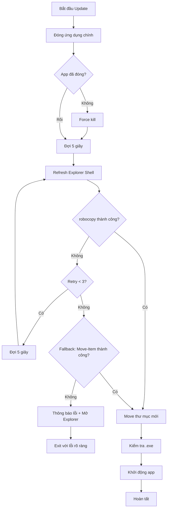

# Kế hoạch sửa lỗi: Windows Explorer khóa thư mục khi cập nhật

## Phân tích log lỗi hiện tại

### Log lỗi:
```
[INFO] Ten process can tim: Mo ma lieu UI
[INFO] Ung dung khong con chay!
[1/4] Dang sao luu he thong cu...
Move: C:\Users\Kelly\Desktop\in use 打开料号 -> C:\Users\Kelly\Desktop\in use 打开料号_backup_20260311_222916
[DEBUG] Folder bi khoa: Cannot rename the item at 'C:\Users\Kelly\Desktop\in use 打开料号' because it is in use.
[DEBUG] Cac process lien quan: explorer, explorer, explorer, explorer, explorer
[DEBUG] Folder bi khoa, khong the rename...
[DEBUG] Thu lai sau 5 giay... (con 14 lan)
... (repeated 15 times)
[LOI] Khong the di chuyen sau 15 lan thu!
[LOI] Co the co ung dung hoac process khac dang su dung folder nay.
[LOI] Vui long dong cac ung dung dang mo folder nay (vi du: Windows Explorer)
```

### Nguyên nhân gốc rễ:
1. **Ứng dụng chính đã đóng thành công** - Log xác nhận: `"Ung dung khong con chay!"`
2. **Windows Explorer đang khóa thư mục** - Có nhiều process Explorer đang giữ handles
3. **Code hiện tại chỉ liệt kê process nhưng không xử lý** - Lines 646-677 trong [`updater.py`](updater.py:646-677) chỉ hiển thị tên process nhưng không giải phóng lock
4. **Move-Item yêu cầu exclusive lock** - Rename/Move thư mục yêu cầu không có process nào đang sử dụng

---

## Giải pháp được đề xuất

### Bước 1: Sử dụng robocopy thay vì Move-Item

**Tại sao robocopy tốt hơn:**
- Robocopy có thể xử lý tốt hơn với các file đang bị khóa
- Có thể copy thay vì move ngay lập tức
- Retry logic tích hợp sẵn

```powershell
# Thay vì Move-Item, sử dụng robocopy để di chuyển
# Bước 1a: Copy thư mục cũ sang backup
Write-Host "[1/4] Dang sao luu he thong cu bang robocopy..."
$robocopyResult = robocopy $OnedirPath $BackupPath /E /MOVE /R:3 /W:5 /MT:8 /NFL /NDL /NC /NS /NP

# robocopy return codes:
# 0-7 = success (0=no files copied, 1=files copied, 2=extra files)
# 8+ = error

if ($robocopyResult -ge 8) {
    Write-Host "[WARN] Robocopy that bai voi ma: $robocopyResult"
    # Fallback về Move-Item
}
```

### Bước 2: Refresh Windows Explorer Shell

Trước khi thử di chuyển, refresh Explorer để giải phóng các handles:

```powershell
# Refresh Explorer shell để giải phóng locks
function Refresh-ExplorerShell {
    Write-Host "[INFO] Dang refresh Windows Explorer..."
    
    # Gửi message để refresh
    Add-Type -TypeDefinition @"
using System;
using System.Runtime.InteropServices;
public class Explorer {
    [DllImport("shell32.dll")]
    public static extern void SHChangeNotify(int wEventId, int uFlags, IntPtr dwItem1, IntPtr dwItem2);
}
"@
    
    # SHCNE_UPDIR = 0x00000002, SHCNF_IDLIST = 0x0000
    [Explorer]::SHChangeNotify(0x00000002, 0x0000, [IntPtr]::Zero, [IntPtr]::Zero)
    
    Start-Sleep -Seconds 2
    Write-Host "[INFO] Da refresh Explorer shell"
}
```

### Bước 3: Thử đóng cửa sổ Explorer cụ thể

Nếu có cửa sổ Explorer đang mở thư mục, đóng chúng:

```powershell
# Tìm và đóng các cửa sổ Explorer đang mở thư mục
function Close-ExplorerWindowsWithPath {
    param([string]$FolderPath)
    
    $shell = New-Object -ComObject Shell.Application
    $windows = $shell.Windows()
    
    foreach ($window in $windows) {
        try {
            if ($window.Document.Folder.Self.Path -like "*$FolderPath*") {
                Write-Host "[INFO] Dong cua so Explorer: $($window.LocationName)"
                $window.Quit()
            }
        } catch {}
    }
    
    [System.Runtime.Interopservices.Marshal]::ReleaseComObject($windows) | Out-Null
}
```

### Bước 4: Fallback strategy với xóa thủ công

Nếu tất cả đều thất bại, thông báo user rõ ràng hơn:

```powershell
# Khi fail cuối cùng
if (-not $moveSuccess) {
    Write-Host "[LOI] Thu muc bi khoa boi Windows Explorer"
    Write-Host "[LOI] Vui long dong tat ca cua so Explorer va thu lai"
    Write-Host "[LOI] Hoac khoi dong lai may de giai phong locks"
    
    # Mở folder cha để user tự xử lý
    explorer.exe $ParentDir
    
    exit 1
}
```

---

## Files cần sửa

| File | Vị trí | Thay đổi |
|------|--------|----------|
| [`updater.py`](updater.py:620-695) | Hàm `apply_onedir_update()` - Section Bước 1 | Thay thế `Move-Item` bằng `robocopy` |
| [`updater.py`](updater.py:599-602) | Sau khi đóng app | Thêm `Refresh-ExplorerShell` |
| [`updater.py`](updater.py:628-681) | Loop retry | Cải thiện logic xử lý Explorer |

---

## Mermaid: Luồng xử lý mới



---

## Checklist triển khai

- [ ] Thêm function `Refresh-ExplorerShell` để refresh Explorer
- [ ] Thêm function `Close-ExplorerWindowsWithPath` để đóng cửa sổ Explorer cụ thể
- [ ] Thay thế `Move-Item` bằng `robocopy /MOVE` trong bước 1
- [ ] Thêm retry logic cho robocopy (3 lần)
- [ ] Fallback về Move-Item nếu robocopy thất bại
- [ ] Cải thiện thông báo lỗi cuối cùng
- [ ] Test với Explorer đang mở folder
- [ ] Test với Explorer không mở folder