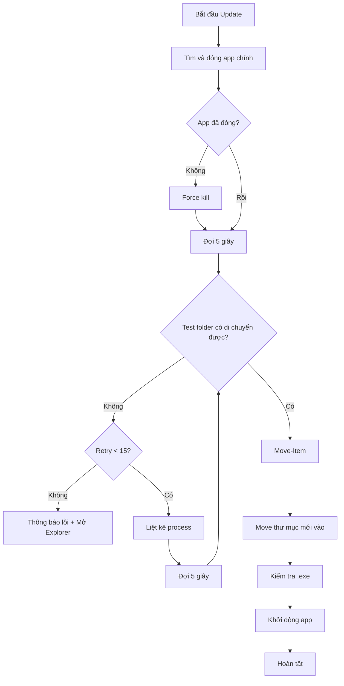

# Kế hoạch sửa lỗi: File vẫn bị khóa sau khi đóng ứng dụng

## Phân tích lỗi hiện tại

### Log lỗi:
```
[INFO] Ten process can tim: Mo ma lieu UI
[INFO] Ung dung khong con chay!
[1/4] Dang sao luu he thong cu...
[DEBUG] Move that bai: Cannot move item because the item at 'C:\Users\Kelly\Desktop\in use 打开料号' is in use.
```

### Nguyên nhân:
1. **Ứng dụng chính đã đóng** - process không còn chạy
2. **Process khác đang khóa file/folder** - có thể là:
   - Windows Explorer đang mở folder
   - Antivirus đang quét
   - Windows Indexing service
   - Một process khác đang sử dụng file trong folder

---

## Giải pháp

### Bước 1: Cải thiện PowerShell Script

**Thêm logic tìm và thông báo các process đang khóa folder:**

```powershell
# Sau khi đóng ứng dụng, kiểm tra xem có gì đang khóa folder không
function Get-BlockingProcesses {
    param([string]$FolderPath)
    
    $processes = @()
    try {
        # Lấy danh sách các file trong folder
        $files = Get-ChildItem -Path $FolderPath -Recurse -File -ErrorAction SilentlyContinue
        
        # Với mỗi file, thử tìm process đang sử dụng
        foreach ($file in $files) {
            try {
                $handles = (Get-Process | Where-Object {
                    $_.Modules.ModuleName -match $file.Name
                } | Select-Object -First 1)
                
                if ($handles) {
                    $processes += $handles
                }
            } catch {}
        }
    } catch {}
    
    return $processes | Select-Object -Unique
}
```

### Bước 2: Sử dụng phương pháp di chuyển thay thế

**Thay vì dùng Move-Item, sử dụng robocopy:**

```powershell
# Sử dụng robocopy để di chuyển thay vì Move-Item
# robocopy xử lý tốt hơn với các file đang bị khóa

# Bước 2a: Copy thư mục cũ sang backup
Write-Host "[1/4] Dang sao luu he thong cu bang robocopy..."
$robocopyResult = robocopy $OnedirPath $BackupPath /E /MOVE /R:10 /W:5 /TEE /LOG+: "$ParentDir\robocopy_log.txt"

# Kiểm tra kết quả robocopy (code 0-7 là thành công)
if ($robocopyResult -ge 8) {
    Write-Host "[LOI] Robocopy that bai voi ma: $robocopyResult"
    # Thử cách khác nếu robocopy fail
}
```

### Bước 3: Thêm kiểm tra và chờ đợi file lock

```powershell
# Hàm kiểm tra xem folder có thể di chuyển được không
function Test-FolderMovable {
    param([string]$FolderPath)
    
    try {
        # Thử rename thử folder
        $testName = $FolderPath + ".test"
        Rename-Item -Path $FolderPath -NewName (Split-Path $testName -Leaf) -ErrorAction Stop
        Rename-Item -Path $testName -NewName (Split-Path $FolderPath -Leaf) -ErrorAction Stop
        return $true
    } catch {
        return $false
    }
}

# Loop với kiểm tra
$retryCount = 15  # Tăng số lần thử
$waitSeconds = 5  # Tăng thời gian đợi

while ($retryCount -gt 0) {
    if (Test-FolderMovable $OnedirPath) {
        # Thử Move-Item
        try {
            Move-Item -Path $OnedirPath -Destination $BackupPath -Force -ErrorAction Stop
            $moveSuccess = $true
            break
        } catch {}
    }
    
    $retryCount--
    Write-Host "[DEBUG] Folder bi khoa, thu lai sau $waitSeconds giay... (con $retryCount lan)"
    
    # Liệt kê các process đang chạy để debug
    $blockingProcs = Get-Process | Where-Object {
        $_.Path -like "*$app_name*" -or $_.MainWindowTitle -like "*$app_name*"
    }
    if ($blockingProcs) {
        Write-Host "[DEBUG] Cac process lien quan: $($blockingProcs.Name -join ', ')"
    }
    
    Start-Sleep -Seconds $waitSeconds
}
```

### Bước 4: Thêm thông báo cho user

```powershell
# Nếu vẫn không di chuyển được sau nhiều lần thử
Write-Host "[WARN] Khong the di chuyen tu dong!"
Write-Host "[WARN] Co the co ung dung hoac process khac dang su dung folder nay."
Write-Host "[WARN] Vui long dong cac ung dung dang mo folder nay va thu lai."

# Hiển thị folder để user tự xử lý
explorer.exe $OnedirPath
```

---

## Các file cần sửa

| File | Vị trí | Thay đổi |
|------|--------|----------|
| [`updater.py`](updater.py:500-700) | Hàm `apply_onedir_update()` | Cập nhật PowerShell script |

---

## Mermaid: Luồng xử lý mới



---

## Checklist

- [ ] Thêm function kiểm tra folder có thể di chuyển được không
- [ ] Thêm logic liệt kê các process đang khóa
- [ ] Tăng số lần retry lên 15
- [ ] Tăng thời gian đợi lên 5 giây
- [ ] Thêm thông báo cho user nếu vẫn không được
- [ ] Mở Explorer để user có thể tự xử lý nếu cần
