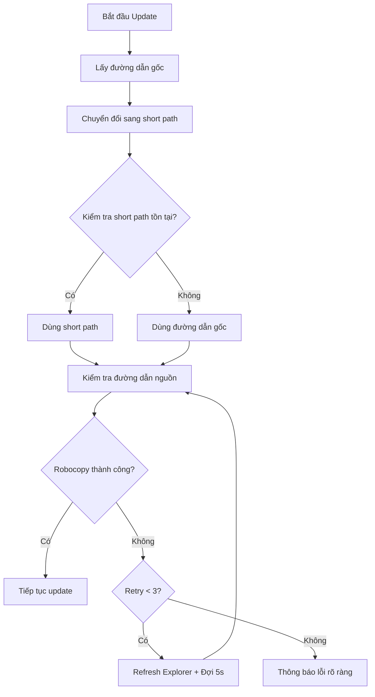

# Kế hoạch: Sửa lỗi Robocopy Exit Code 16 trong Update Script

## 1. Phân tích lỗi hiện tại

### Log lỗi:
```
[1/5] Dang sao luu he thong cu...
Robocopy: 'C:\Users\Kelly\Desktop\INUSE~2\MOMALI~1' -> 'C:\Users\Kelly\Desktop\INUSE~2\MOMALI~1_backup_20260312_144511' (copy)
[INFO] Thu robocopy copy lan 1/3...
[DEBUG] Robocopy exit code: 16
[WARN] Robocopy that bai voi ma: 16
[LOI] Khong the sao luu he thong cu!
```

### Nguyên nhân gốc rễ:

**Robocopy exit code 16** = "Serious error. Robocopy did not copy any files. This is either a usage error or an error due to inconsistent access to files."

Các nguyên nhân có thể:
1. **Short path 8.3 không tồn tại**: `INUSE~2\MOMALI~1` có thể không phải là short path hợp lệ
2. **Thư mục nguồn không thể truy cập**: Có thể bị khóa hoặc không tồn tại
3. **Vấn đề với đường dẫn**: Short path có thể không được tạo đúng

### Phân tích từ log:
- `OnedirPath (long): C:\Users\Kelly\Desktop\INUSE~2\MOMALI~1` - Đây là short path 8.3!
- `OnedirPath (short): C:\Users\Kelly\Desktop\INUSE~2\MOMALI~1` - Cùng một giá trị
- Điều này cho thấy `get_short_path_name()` có thể đã trả về short path không chính xác

---

## 2. Giải pháp đề xuất

### Nguyên tắc:
1. **Kiểm tra short path trước khi dùng** - Xem short path có tồn tại thực tế không
2. **Fallback về đường dẫn gốc** - Nếu short path không tồn tại, dùng đường dẫn gốc (PowerShell xử lý Unicode tốt)
3. **Cải thiện logging** - Thêm thông tin debug để hiểu rõ hơn vấn đề

### Sơ đồ luồng xử lý mới:



---

## 3. Các bước thực hiện

### Bước 1: Cập nhật hàm `get_short_path_name()` trong [`updater.py`](updater.py:62-97)

Thêm kiểm tra xem short path có tồn tại không:

```python
def get_short_path_name(long_path):
    """
    Chuyển đổi đường dẫn dài sang định dạng 8.3 ngắn
    Trả về đường dẫn an toàn cho batch script
    
    Args:
        long_path: Đường dẫn gốc (có thể chứa Unicode và dấu cách)
    
    Returns:
        Đường dẫn ngắn dạng 8.3 nếu tồn tại, hoặc đường dẫn gốc nếu thất bại
    """
    if not long_path:
        return long_path
    
    try:
        # Gọi Windows API GetShortPathNameW
        GetShortPathNameW = ctypes.windll.kernel32.GetShortPathNameW
        GetShortPathNameW.argtypes = [wintypes.LPCWSTR, wintypes.LPWSTR, wintypes.DWORD]
        GetShortPathNameW.restype = wintypes.DWORD
        
        # Lấy độ dài cần thiết
        buffer_size = GetShortPathNameW(long_path, None, 0)
        if buffer_size == 0:
            print(f"[UPDATER] Short path: Không chuyển được, dùng đường dẫn gốc")
            return long_path
        
        # Lấy đường dẫn ngắn
        buffer = ctypes.create_unicode_buffer(buffer_size)
        GetShortPathNameW(long_path, buffer, buffer_size)
        short_path = buffer.value
        
        # KIỂM TRA: Short path có tồn tại không?
        if os.path.exists(short_path):
            print(f"[UPDATER] Short path: {long_path} -> {short_path}")
            return short_path
        else:
            print(f"[UPDATER] Short path không tồn tại: {short_path}")
            print(f"[UPDATER] Dùng đường dẫn gốc: {long_path}")
            return long_path
            
    except Exception as e:
        print(f"[UPDATER] Lỗi chuyển đổi short path: {e}")
        return long_path
```

### Bước 2: Cập nhật PowerShell script để debug tốt hơn

Thêm kiểm tra đường dẫn trước khi robocopy:

```powershell
# Kiểm tra đường dẫn nguồn trước khi robocopy
Write-Host "[DEBUG] OnedirPath: $OnedirPath"
Write-Host "[DEBUG] BackupPath: $BackupPath"

# Kiểm tra xem đường dẫn nguồn có tồn tại không
if (-not (Test-Path $OnedirPath)) {
    Write-Host "[LOI] Thu muc nguon khong ton tai: $OnedirPath"
    
    # Thử với đường dẫn gốc nếu là short path
    if ($OnedirPath -match '~') {
        Write-Host "[DEBUG] Phat hien short path, thu lay duong dan day du..."
        # PowerShell có thể xử lý Unicode tốt hơn
    }
    
    exit 1
}

# Liệt kê nội dung thư mục nguồn để debug
Write-Host "[DEBUG] Noi dung thu muc nguon:"
Get-ChildItem -Path $OnedirPath -ErrorAction SilentlyContinue | Select-Object -First 5
```

### Bước 3: Cập nhật PowerShell script để sử dụng đường dẫn gốc khi cần

Thay vì chỉ dùng short path, cho phép PowerShell xử lý đường dẫn Unicode trực tiếp:

```powershell
# Trong PowerShell script, sử dụng đường dẫn gốc nếu short path không hoạt động
# PowerShell hỗ trợ Unicode tốt hơn cmd

# Sử dụng biến môi trường để truyền đường dẫn
$env:ONEDIR_PATH = $OnedirPath
$env:BACKUP_PATH = $BackupPath

# Robocopy với đường dẫn Unicode
$robocopyResult = robocopy "$OnedirPath" "$BackupPath" /E /COPYALL /R:3 /W:5 /MT:8 /NFL /NDL /NC /NS /NP 2>&1
```

### Bước 4: Thêm logging chi tiết hơn cho robocopy

```powershell
# Log chi tiết hơn để debug
$robocopyResult = robocopy "$OnedirPath" "$BackupPath" /E /COPYALL /R:3 /W:5 /MT:8 /V /LOG+: "$ParentDir\robocopy_backup_log.txt" 2>&1
$robocopyExitCode = $LASTEXITCODE

Write-Host "[DEBUG] Robocopy exit code: $robocopyExitCode"
Write-Host "[DEBUG] Robocopy result: $robocopyResult"

# Kiểm tra các nguyên nhân phổ biến của exit code 16
if ($robocopyExitCode -eq 16) {
    Write-Host "[LOI] Robocopy exit code 16: Serious error"
    Write-Host "[LOI] Kiem tra cac nguyen nhan:"
    Write-Host "[LOI] 1. Duong dan nguon khong ton tai hoac khong the truy cap"
    Write-Host "[LOI] 2. Thu muc bi khoa boi process khac"
    Write-Host "[LOI] 3. Khong du quyen truy cap"
    
    # Kiểm tra và hiển thị lỗi chi tiết
    if (-not (Test-Path $OnedirPath)) {
        Write-Host "[LOI] Thu muc nguon khong ton tai: $OnedirPath"
    }
    
    # Liệt kê các process đang sử dụng folder
    $lockingProcesses = Get-Process | Where-Object {
        try { $_.Path -like "*$OnedirPath*" } catch { $false }
    }
    if ($lockingProcesses) {
        Write-Host "[LOI] Process dang khoa: $($lockingProcesses.Name -join ', ')"
    }
}
```

---

## 4. Files cần sửa

| File | Vị trí | Thay đổi |
|------|--------|----------|
| [`updater.py`](updater.py:62-97) | Hàm `get_short_path_name()` | Thêm kiểm tra short path tồn tại, fallback về đường dẫn gốc |
| [`updater.py`](updater.py:760) | Lệnh robocopy backup | Thêm logging chi tiết hơn |
| [`updater.py`](updater.py:734-793) | PowerShell script backup | Thêm kiểm tra đường dẫn trước khi robocopy |

---

## 5. Kết quả mong đợi

- ✅ Robocopy exit code 16 được xử lý đúng cách
- ✅ Thông báo lỗi rõ ràng hơn để debug
- ✅ Fallback về đường dẫn gốc nếu short path không tồn tại
- ✅ PowerShell xử lý đường dẫn Unicode tốt hơn
- ✅ Update hoạt động với các đường dẫn chứa tiếng Việt/Trung Quốc

---

## 6. Lưu ý quan trọng

1. **PowerShell xử lý Unicode tốt hơn batch** - Nên ưu tiên dùng PowerShell với đường dẫn gốc
2. **Short path 8.3 không phải lúc nào cũng tồn tại** - Cần kiểm tra trước khi dùng
3. **Exit code 16 là lỗi nghiêm trọng** - Cần logging chi tiết để debug
4. **Refresh Explorer shell** - Vẫn cần thiết để giải phóng file locks
