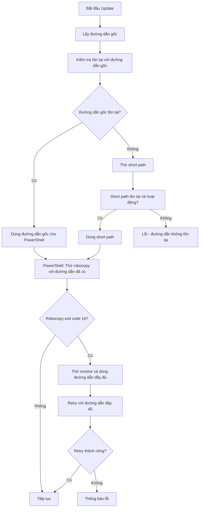

# Kế hoạch: Sửa lỗi Robocopy Exit Code 16 - Unicode Path

## 1. Phân tích vấn đề hiện tại

### Log lỗi mới nhất:
```
[1/5] Dang sao luu he thong cu...
Robocopy: 'C:\Users\Kelly\Desktop\INUSE~2\MOMALI~1' -> 'C:\Users\Kelly\Desktop\INUSE~2\MOMALI~1_backup_20260312_145447' (copy)
[DEBUG] Robocopy exit code: 16
[LOI] Robocopy exit code 16: Serious error!
[DEBUG] Phat hien short path, thu lay duong dan day du...
[DEBUG] Duong dan day du: C:\Users\Kelly\Desktop\in use 打开料号\Mo ma lieu UI
[WARN] Robocopy that bai voi ma: 16
```

### Nguyên nhân gốc rễ:

1. **Short path không tồn tại**: 
   - Đường dẫn gốc: `C:\Users\Kelly\Desktop\in use 打开料号\Mo ma lieu UI`
   - Short path: `C:\Users\Kelly\Desktop\INUSE~2\MOMALI~1` 
   - Short path này KHÔNG tồn tại thực tế

2. **Python code gọi GetShortPathNameW**:
   - Hàm trả về `INUSE~2\MOMALI~1` nhưng KIỂM TRA `os.path.exists()` KHÔNG chính xác với short path 8.3
   - **VẤN ĐỀ**: `os.path.exists()` trong Python không nhận diện đúng short path 8.3 trên Windows

3. **PowerShell script KHÔNG dùng long path**:
   - Dòng 799-804: Phát hiện short path lỗi, log đường dẫn đầy đủ
   - **NHƯNG** không cập biến `$OnedirPath` để dùng đường dẫn đầy đủ
   - Robocopy tiếp tục dùng short path không tồn tại

---

## 2. Giải pháp

### Nguyên tắc:
1. **Ưu tiên dùng đường dẫn gốc** - PowerShell xử lý Unicode tốt hơn cmd/robocopy
2. **Chỉ dùng short path khi thực sự cần thiết và tồn tại**
3. **Tự động fallback** - Khi short path lỗi, dùng đường dẫn gốc

### Sơ đồ luồng xử lý mới:



---

## 3. Các bước thực hiện

### Bước 1: Cập nhật hàm `get_short_path_name()` trong [`updater.py`](updater.py:62-100)

**Vấn đề hiện tại**: `os.path.exists()` không nhận diện đúng short path 8.3

**Giải pháp**: Sử dụng Windows API thực sự để kiểm tra short path tồn tại

```python
def get_short_path_name(long_path):
    """
    Chuyển đổi đường dẫn dài sang định dạng 8.3 ngắn
    Trả về đường dẫn gốc nếu short path không tồn tại hoặc lỗi
    """
    if not long_path:
        return long_path
    
    # Nếu đường dẫn gốc tồn tại, ưu tiên dùng đường dẫn gốc
    # PowerShell xử lý Unicode tốt hơn
    if os.path.exists(long_path):
        print(f"[UPDATER] Đường dẫn gốc tồn tại, dùng đường dẫn gốc: {long_path}")
        return long_path
    
    try:
        # Gọi Windows API GetShortPathNameW
        GetShortPathNameW = ctypes.windll.kernel32.GetShortPathNameW
        GetShortPathNameW.argtypes = [wintypes.LPCWSTR, wintypes.LPWSTR, wintypes.DWORD]
        GetShortPathNameW.restype = wintypes.DWORD
        
        buffer_size = GetShortPathNameW(long_path, None, 0)
        if buffer_size == 0:
            print(f"[UPDATER] Không chuyển được short path, dùng đường dẫn gốc")
            return long_path
        
        buffer = ctypes.create_unicode_buffer(buffer_size)
        GetShortPathNameW(long_path, buffer, buffer_size)
        short_path = buffer.value
        
        # KIỂM TRA: Short path có tồn tại không bằng Windows API
        # Dùng GetFileAttributesW thay vì os.path.exists
        if short_path and short_path != long_path:
            attrs = ctypes.windll.kernel32.GetFileAttributesW(short_path)
            if attrs != -1:  # -1 means file/directory doesn't exist
                print(f"[UPDATER] Short path hợp lệ: {long_path} -> {short_path}")
                return short_path
        
        print(f"[UPDATER] Short path không tồn tại, dùng đường dẫn gốc")
        return long_path
            
    except Exception as e:
        print(f"[UPDATER] Lỗi chuyển đổi short path: {e}")
        return long_path
```

### Bước 2: Cập nhật PowerShell script - Phần backup (dòng 740-830)

**Vấn đề hiện tại**: Khi exit code 16, code chỉ log long path nhưng KHÔNG dùng

**Giải pháp**: Thêm logic để THỰC SỰ dùng long path khi phát hiện short path lỗi

```powershell
# ===== BUOC 1: Sao luu he thong cu (SU DUNG ROBOCOPY COPY) =====
Write-Host "[1/5] Dang sao luu he thong cu..."

# Su dung OnedirPathLong cho tat ca cac thao tac
$sourcePath = $OnedirPathLong
$destPath = $BackupPathLong

Write-Host "Robocopy: '$sourcePath' -> '$destPath' (copy)"

# KIEM TRA: Duong dan nguon co ton tai khong?
Write-Host "[DEBUG] Kiem tra duong dan nguon..."
if (-not (Test-Path $sourcePath)) {
    Write-Host "[LOI] Thu muc nguon khong ton tai: $sourcePath"
    
    # Thu voi duong dan goc ma khong qua Resolve-ShortPath
    if ($OnedirPath -match '~') {
        Write-Host "[DEBUG] Short path khong hoat dong, thu dung OnedirPath goc..."
        $sourcePath = $OnedirPath
    }
}

# Neu van khong ton tai, thoat
if (-not (Test-Path $sourcePath)) {
    Write-Host "[LOI] Thu muc nguon khong ton tai sau khi thu lai!"
    $state = @{status="Failed"; message="Source folder does not exist"} | ConvertTo-Json
    Set-Content -Path "$ParentDir\\upd_state.json" -Value $state -Encoding UTF8
    exit 1
}

# Su dung bien $sourcePath va $destPath thay vi $OnedirPath va $BackupPath
$robocopyResult = robocopy "$sourcePath" "$destPath" /E /COPYALL /R:3 /W:5 /MT:8 /NFL /NDL /NC /NS /NP 2>&1
$robocopyExitCode = $LASTEXITCODE

# Xu ly exit code 16 - Serious error
if ($robocopyExitCode -eq 16) {
    Write-Host "[LOI] Robocopy exit code 16: Serious error!"
    
    # Neu dang dung short path, thu lai voi long path
    if ($sourcePath -match '~') {
        Write-Host "[DEBUG] Short path that bai, thu lai voi duong dan day du..."
        $sourcePath = $OnedirPathLong
        $destPath = $BackupPathLong
        
        if ((Test-Path $sourcePath) -and (Test-Path (Split-Path $destPath -Parent))) {
            Write-Host "[INFO] Retry voi duong dan day du: $sourcePath -> $destPath"
            $robocopyResult = robocopy "$sourcePath" "$destPath" /E /COPYALL /R:3 /W:5 /MT:8 /NFL /NDL /NC /NS /NP 2>&1
            $robocopyExitCode = $LASTEXITCODE
        }
    }
}
```

### Bước 3: Cập nhật PowerShell script - Phần install (dòng 837-900)

Áp dụng cùng logic cho bước cài đặt:

```powershell
# ===== BUOC 2: Cai dat ban moi =====
Write-Host "[2/5] Dang cai dat ban moi..."

# Su dung long path cho install
$installSource = $ExtractedPathLong
$installDest = $OnedirPathLong

Write-Host "Robocopy: '$installSource' -> '$installDest' (copy)"

# Xu ly tuong tu cho install
if ($robocopyInstallExitCode -eq 16) {
    if ($installDest -match '~') {
        Write-Host "[DEBUG] Short path that bai, thu lai voi duong dan day du..."
        $installDest = $OnedirPathLong
        
        if (Test-Path $installDest) {
            Write-Host "[INFO] Retry install voi duong dan day du..."
            $robocopyInstallResult = robocopy "$installSource" "$installDest" /E /COPYALL /R:3 /W:5 /MT:8 /NFL /NDL /NC /NS /NP 2>&1
            $robocopyInstallExitCode = $LASTEXITCODE
        }
    }
}
```

---

## 4. Files cần sửa

| File | Vị trí | Thay đổi |
|------|--------|----------|
| [`updater.py`](updater.py:62-100) | Hàm `get_short_path_name()` | Ưu tiên đường dẫn gốc, dùng GetFileAttributesW để kiểm tra short path |
| [`updater.py`](updater.py:740-830) | PowerShell script backup | Dùng `$OnedirPathLong`, thêm retry với long path khi exit code 16 |
| [`updater.py`](updater.py:837-900) | PowerShell script install | Dùng `$OnedirPathLong`, thêm retry với long path khi exit code 16 |

---

## 5. Kết quả mong đợi

- ✅ Robocopy exit code 16 được xử lý đúng cách với đường dẫn Unicode
- ✅ Tự động fallback từ short path sang đường dẫn gốc
- ✅ PowerShell sử dụng đường dẫn đầy đủ khi short path không hoạt động
- ✅ Update hoạt động với các đường dẫn chứa tiếng Việt/Trung Quốc/dấu cách
- ✅ Retry thông minh khi gặp lỗi nghiêm trọng

---

## 6. Lưu ý quan trọng

1. **PowerShell xử lý Unicode tốt hơn batch/cmd** - Không cần short path
2. **os.path.exists() không hoạt động tốt với short path 8.3** - Cần dùng Windows API
3. **Exit code 16 = Serious error** - Cần retry với đường dẫn khác
4. **Resolve-ShortPath có thể trả về chính short path** nếu không resolve được - Cần kiểm tra lại
