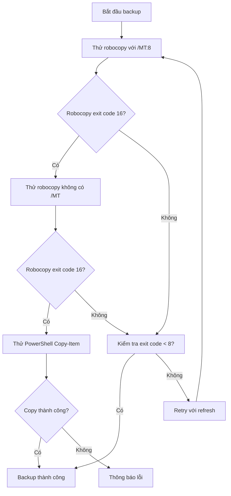

# Kế hoạch: Khắc phục lỗi Robocopy Exit Code 16 với đường dẫn Unicode

## 1. Phân tích vấn đề hiện tại

### Log lỗi mới nhất:
```
OnedirPath (long): C:\Users\Kelly\Desktop\新建文件夹\Tool open
BackupPath (long): C:\Users\Kelly\Desktop\新建文件夹\Tool open_backup_20260312_150650

[DEBUG] Noi dung thu muc nguon (5 items dau):
[DEBUG]   - Khac
[DEBUG]   - plans
[DEBUG]   - updater-master
[DEBUG]   - __pycache__
[DEBUG]   - create_update.py

[DEBUG] Source: C:\Users\Kelly\Desktop\新建文件夹\Tool open -> Dest: C:\Users\Kelly\Desktop\新建文件夹\Tool open_backup_20260312_150650
[DEBUG] Robocopy exit code: 16
```

### Nguyên nhân gốc rễ:

1. **Đường dẫn đã được resolve đúng**: `$OnedirPathLong` hiển thị đường dẫn Unicode đầy đủ
   
2. **Thư mục nguồn tồn tại**: Có 5 items được liệt kê thành công

3. **Robocopy exit code 16 vẫn xảy ra**: Mặc dù đường dẫn đúng

4. **Nguyên nhân có thể**:
   - **Tham số `/MT:8` (multi-threaded)**: Có thể gây xung đột với Unicode
   - **Thiếu tham số `/V`**: Không có verbose output để debug
   - **Permission issue**: Có thể có vấn đề quyền truy cập với thư mục Unicode
   - **Destination path issue**: Đường dẫn backup có thể có vấn đề

---

## 2. Giải pháp đề xuất

### Sơ đồ luồng xử lý mới:



---

## 3. Các bước thực hiện

### Bước 1: Cập nhật lệnh robocopy trong [`updater.py`](updater.py:815)

**Thay đổi 1**: Bỏ tham số `/MT:8` hoặc giảm số thread

**Thay đổi 2**: Thêm tham số `/V` để có verbose output

**Thay đổi 3**: Thêm kiểm tra và retry không có /MT

```python
# Thay thế dòng 815 trong updater.py
# Trước:
# $robocopyResult = robocopy "$sourcePath" "$destPath" /E /COPYALL /R:3 /W:5 /MT:8 /NFL /NDL /NC /NS /NP 2>&1

# Sau:
# Thử với /MT:8 trước (nhanh hơn)
$robocopyResult = robocopy "$sourcePath" "$destPath" /E /COPYALL /R:3 /W:5 /MT:8 /V /NFL /NDL /NC /NS /NP 2>&1
$robocopyExitCode = $LASTEXITCODE

# Nếu exit code 16, thử lại không có /MT
if ($robocopyExitCode -eq 16) {
    Write-Host "[DEBUG] Thu lai khong co /MT:8..."
    $robocopyResult = robocopy "$sourcePath" "$destPath" /E /COPYALL /R:3 /W:5 /V /NFL /NDL /NC /NS /NP 2>&1
    $robocopyExitCode = $LASTEXITCODE
}
```

### Bước 2: Thêm fallback sử dụng PowerShell Copy-Item

**Thêm sau phần robocopy thất bại**:

```powershell
# Nếu robocopy vẫn thất bại, thử dùng PowerShell Copy-Item
if ($robocopyExitCode -ge 8) {
    Write-Host "[DEBUG] Thu dung PowerShell Copy-Item..."
    
    try {
        # Sử dụng Copy-Item với -Recurse
        Copy-Item -Path "$sourcePath\*" -Destination "$destPath" -Recurse -Force -ErrorAction Stop
        $robocopyExitCode = 1  # Thành công
        Write-Host "[INFO] Copy-Item thanh cong!"
    } catch {
        Write-Host "[LOI] Copy-Item that bai: $_"
        $robocopyExitCode = 16
    }
}
```

### Bước 3: Cải thiện logging

**Thêm hiển thị kết quả robocopy**:

```powershell
# Sau mỗi lần chạy robocopy
if ($robocopyResult) {
    Write-Host "[DEBUG] Robocopy output:"
    $robocopyResult | Select-Object -First 10 | ForEach-Object {
        Write-Host "  $_"
    }
}
```

---

## 4. Files cần sửa

| File | Vị trí | Thay đổi |
|------|--------|----------|
| [`updater.py`](updater.py:815) | Lệnh robocopy backup | Thêm /V, xử lý exit code 16 tốt hơn |
| [`updater.py`](updater.py:830-845) | Xử lý exit code 16 | Thử lại không có /MT:8 |
| [`updater.py`](updater.py:845-862) | Retry logic | Thêm fallback Copy-Item |

---

## 5. Kết quả mong đợi

- ✅ Robocopy exit code 16 được xử lý tốt hơn
- ✅ Thử lại không có /MT:8 khi gặp lỗi
- ✅ Fallback sang PowerShell Copy-Item nếu robocopy tiếp tục lỗi
- ✅ Logging chi tiết hơn để debug
- ✅ Update hoạt động với đường dẫn Unicode

---

## 6. Lưu ý quan trọng

1. **Robocopy /MT:8 có thể gây vấn đề với Unicode** - Cần theo dõi
2. **PowerShell Copy-Item xử lý Unicode tốt hơn** - Là fallback tốt
3. **Cần thêm /V để debug** - Giúp hiểu lỗi rõ hơn
4. **Exit code 16 = Serious error** - Không chỉ là "source not found"

---

## 7. Cách test

1. Chạy update với thư mục có ký tự Unicode
2. Kiểm tra log để xem:
   - Robocopy có /MT:8 có lỗi không
   - Robocopy không có /MT:8 có lỗi không
   - Copy-Item có hoạt động không
