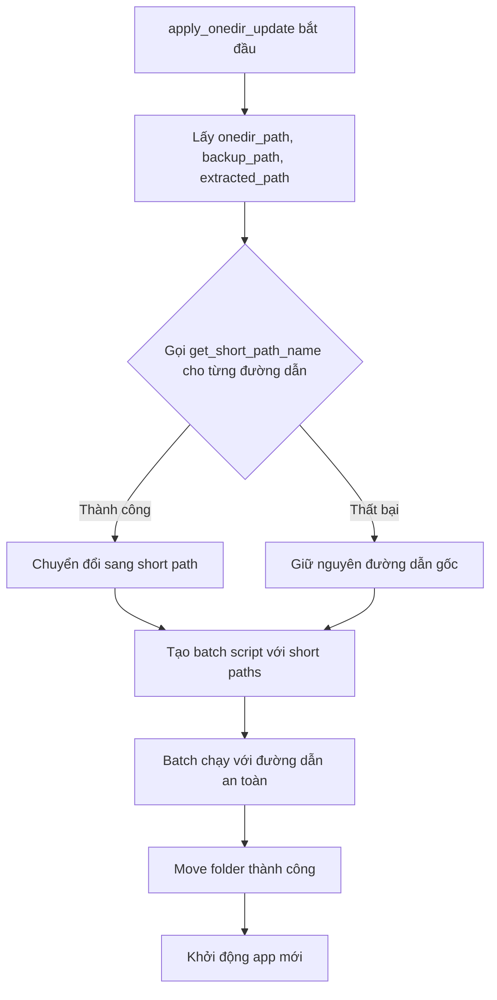

# Kế hoạch sửa lỗi Batch Script với đường dẫn Unicode

## Tổng quan lỗi

### Log lỗi:
```
move /y "C:\Users\Kelly\Desktop\in use 打开料号" "C:\Users\Kelly\Desktop\in use 打开料号_backup_20260311_210048"
... was unexpected at this time.
```

### Nguyên nhân gốc rễ

**Vấn đề:** Windows Batch script không xử lý đúng đường dẫn chứa:
1. Dấu cách ("in use")  
2. Ký tự Unicode tiếng Trung ("打开料号")

**Vị trí lỗi:** [`updater.py:437-439`](updater.py:437)

```python
set "ONEDIR_PATH={onedir_path}"
set "BACKUP_PATH={backup_path}"
set "EXTRACTED_PATH={final_extracted_folder}"
```

Khi đường dẫn chứa Unicode, lệnh `set` trong CMD có thể không parse đúng, dẫn đến lỗi "...was unexpected at this time".

---

## Các phương án giải quyết

### Phương án 1: Chuyển đổi sang định dạng đường dẫn ngắn 8.3 (Khuyến nghị)

Sử dụng Windows API `GetShortPathNameW` để chuyển đổi đường dẫn Unicode sang định dạng 8.3 không có dấu và ký tự đặc biệt.

**Ví dụ:**
- `C:\Users\Kelly\Desktop\in use 打开料号` → `C:\Users\KELLY~1\INUSE~1`

**Ưu điểm:**
- Ít thay đổi code nhất
- Vẫn giữ nguyên logic batch

**Nhược điểm:**
- Short path có thể không tồn tại trên một số hệ thống
- Tên ngắn có thể khó đọc trong log

---

### Phương án 2: Sử dụng PowerShell thay vì Batch (Bạn đang hỏi)

PowerShell hỗ trợ Unicode tốt hơn batch. Thay vì tạo file `.bat`, tạo file `.ps1` với nội dung PowerShell.

**Ưu điểm:**
- Hỗ trợ Unicode tốt natively
- Xử lý lỗi tốt hơn với try/catch
- Cú pháp hiện đại hơn

**Nhược điểm:**
- Cần thay đổi nhiều hơn trong code
- Có thể bị chặn bởi Execution Policy
- Người dùng cần xác nhận chạy script

**Ví dụ PowerShell script:**
```powershell
# apply_update.ps1
$onedirPath = "C:\Users\Kelly\Desktop\in use 打开料号"
$backupPath = "C:\Users\Kelly\Desktop\in use 打开料号_backup"
$extractedPath = "C:\Users\Kelly\AppData\Local\Temp\app_update\extracted"

# Di chuyển thư mục
Move-Item -Path $onedirPath -Destination $backupPath -Force
Move-Item -Path $extractedPath -Destination $onedirPath -Force

# Tìm và chạy exe
$exe = Get-ChildItem -Path $onedirPath -Filter "*.exe" | Select-Object -First 1
Start-Process -FilePath $exe.FullName
```

---

## Các bước thực hiện theo Phương án 1 (Khuyến nghị)

### Bước 1: Thêm hàm chuyển đổi đường dẫn sang short path

Thêm vào [`updater.py`](updater.py):

```python
import ctypes
from ctypes import wintypes

def get_short_path_name(long_path):
    """
    Chuyển đổi đường dẫn dài sang định dạng 8.3 ngắn
    Trả về đường dẫn an toàn cho batch script
    """
    try:
        # Gọi Windows API GetShortPathNameW
        GetShortPathNameW = ctypes.windll.kernel32.GetShortPathNameW
        GetShortPathNameW.argtypes = [wintypes.LPCWSTR, wintypes.LPWSTR, wintypes.DWORD]
        GetShortPathNameW.restype = wintypes.DWORD
        
        # Lấy độ dài cần thiết
        buffer_size = GetShortPathNameW(long_path, None, 0)
        if buffer_size == 0:
            return long_path  # Trả về đường dẫn gốc nếu thất bại
        
        # Lấy đường dẫn ngắn
        buffer = ctypes.create_unicode_buffer(buffer_size)
        GetShortPathNameW(long_path, buffer, buffer_size)
        return buffer.value
    except Exception as e:
        print(f"[UPDATER] Lỗi chuyển đổi short path: {e}")
        return long_path
```

### Bước 2: Cập nhật hàm apply_onedir_update

Sửa trong [`updater.py:410-422`](updater.py:410):

```python
# Chuyển đổi đường dẫn sang short path để tránh lỗi Unicode trong batch
onedir_path_short = get_short_path_name(onedir_path)
backup_path_short = get_short_path_name(backup_path)
final_extracted_folder_short = get_short_path_name(final_extracted_folder)

print(f"[UPDATER] Short path onedir: {onedir_path_short}")
print(f"[UPDATER] Short path backup: {backup_path_short}")
print(f"[UPDATER] Short path extracted: {final_extracted_folder_short}")
```

### Bước 3: Cập nhật batch script template

Sử dụng các biến short path trong batch content:

```python
bat_content = rf"""@echo off
chcp 65001 > NUL
setlocal enabledelayedexpansion

REM Sử dụng short paths để tránh lỗi Unicode
set "ONEDIR_PATH={onedir_path_short}"
set "BACKUP_PATH={backup_path_short}"
set "EXTRACTED_PATH={final_extracted_folder_short}"

echo ========================================
echo BATCRIPT UPDATE - DEBUG MODE
echo ========================================
echo onedir_path: %ONEDIR_PATH%
echo backup_path: %BACKUP_PATH%
echo extracted_path: %EXTRACTED_PATH%
echo ========================================
...
"""
```

### Bước 4: Cập nhật đường dẫn trong các lệnh move và echo

Đảm bảo tất cả các lệnh `move` và `echo` sử dụng short path. Đặc biệt lưu ý các vị trí:
- Dòng 453: `echo move /y "%ONEDIR_PATH%" "%BACKUP_PATH%"`
- Dòng 461: `move /y "%ONEDIR_PATH%" "%BACKUP_PATH%"`
- Dòng 480: `echo move /y "%EXTRACTED_PATH%" "%ONEDIR_PATH%"`
- Dòng 483: `move /y "%EXTRACTED_PATH%" "%ONEDIR_PATH%"`

### Bước 5: Cập nhật đường dẫn thư mục cha cho state file

Cập nhật các vị trí ghi state file (dòng 475, 489, 499, 519, 524):

```python
# Lng dẫn thư mụcấy đườ cha (short path)
parent_dir = os.path.dirname(onedir_path)
parent_dir_short = get_short_path_name(parent_dir)

# Sử dụng trong batch:
echo {{"status": "Failed", ...}} > "{parent_dir_short}\\update_state.json"
```

---

## Files cần sửa

1. **[`updater.py`](updater.py)** - Thêm hàm `get_short_path_name()` và cập nhật `apply_onedir_update()`

---

## Mermaid: Luồng xử lý mới



---

## Kiểm tra sau khi sửa

- [ ] Đường dẫn có dấu cách và Unicode được xử lý đúng
- [ ] Lệnh `move` thực thi thành công
- [ ] Ứng dụng khởi động lại sau khi cập nhật
- [ ] File state được ghi đúng vị trí
