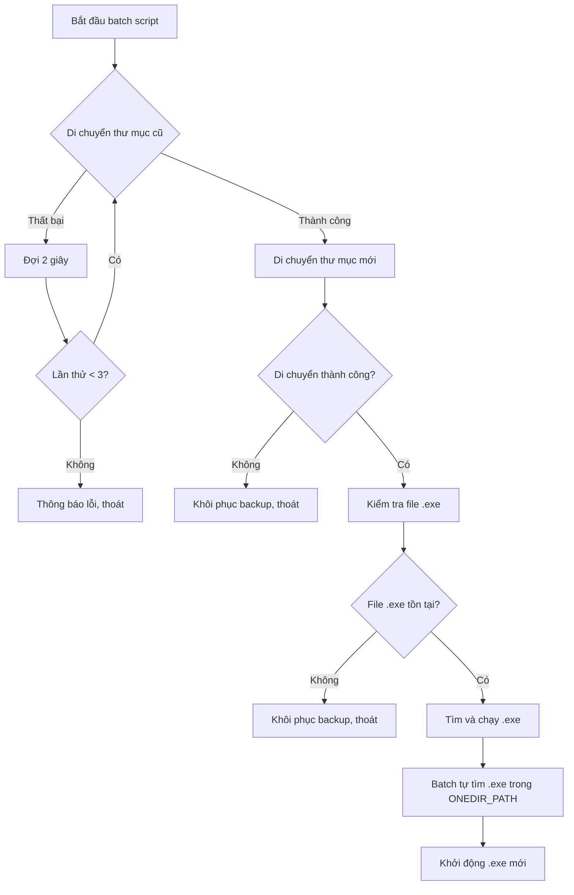

# Kế hoạch sửa lỗi Update - Batch Script không tìm thấy file

## Tổng quan lỗi

### Log lỗi:
```
[1/3] Dang sao luu he thong cu...
move /y "C:\Users\Kelly\Desktop\Tool open\dist\Mo ma lieu UI" "C:\Users\Kelly\Desktop\Tool open\dist\Mo ma lieu UI_backup_20260311_203413"
[DEBUG] Thuc muc nguon ton tai, thuc hien move...
The process cannot access the file because it is being used by another process.
        0 dir(s) moved.
[DEBUG] Move thu muc cu thanh cong
[2/3] Dang cai dat ban moi...
move /y "C:\Users\Kelly\AppData\Local\Temp\app_update_20260311_203412\extracted\Mo ma lieu UI" "C:\Users\Kelly\Desktop\Tool open\dist\Mo ma lieu UI"
[DEBUG] Thu muc giai nen ton tai, thuc hien move...
        1 dir(s) moved.
[LOI] Khong the cai dat phien ban moi Dang khoi phuc ban sao luu...
Dang khoi dong lai ung dung...
start_cmd: start "" "C:\Users\Kelly\Desktop\Tool open\dist\Mo ma lieu UI\Mo ma lieu UI.exe"
The batch file cannot be found.
```

---

## Nguyên nhân gốc rễ

### 🔴 Nguyên nhân 1: Ứng dụng đang chạy khi update

**Hiện tượng:** Lỗi "The process cannot access the file because it is being used by another process"

**Giải thích:** 
- Khi người dùng bấm "Yes" để cập nhật, ứng dụng vẫn đang chạy
- Batch script không thể di chuyển thư mục vì có file đang bị khóa
- Thư mục gốc không thể di chuyển được

**Giải pháp:** 
- Thêm cơ chế đợi và kiểm tra xem ứng dụng đã đóng chưa
- Hoặc buộc đóng ứng dụng trước khi update
- Cần đợi đủ lâu để process hoàn toàn kết thúc

### 🔴 Nguyên nhân 2: Đường dẫn exe sai trong batch script

**Vị trí:** [`updater.py:424-427`](updater.py:424)

```python
exe_target = sys.executable if getattr(sys, 'frozen', False) else os.path.join(onedir_path, 'Mở mã liệu UI.py')
start_cmd = f'start "" "{exe_target}"'
```

**Vấn đề:** 
- `sys.executable` trả về đường dẫn exe hiện tại đang chạy
- Nhưng trong batch script, khi chạy, thư mục gốc đã bị thay đổi
- Đường dẫn `C:\Users\Kelly\Desktop\Tool open\dist\Mo ma lieu UI\Mo ma lieu UI.exe` có thể không đúng sau khi swap folder

**Giải pháp:**
- Sử dụng đường dẫn từ biến `%ONEDIR_PATH%` trong batch script
- Hoặc xây dựng đường dẫn exe mới từ thư mục đích

---

## Các bước sửa lỗi

### Bước 1: Cải thiện batch script - Đợi ứng dụng đóng

**Thêm vòng lặp đợi và thử lại:**

```batch
REM Đợi và thử di chuyển nhiều lần
set "MOVE_RETRY=3"
:retry_move
if %MOVE_RETRY% GTR 0 (
    move /y "%ONEDIR_PATH%" "%BACKUP_PATH%"
    if %ERRORLEVEL% NEQ 0 (
        echo [DEBUG] Move failed, retrying in 2 seconds...
        set /a MOVE_RETRY-=1
        timeout /t 2 /nobreak > NUL
        goto :retry_move
    )
) else (
    echo [LOI] Khong the di chuyen sau %MOVE_RETRY% lan thu!
    goto :LaunchAndExit
)
```

### Bước 2: Sửa đường dẫn exe trong batch script

**Thay vì sử dụng `sys.executable`:**

```python
# Sửa trong updater.py - Line 424-427
# Thay vì:
exe_target = sys.executable if getattr(sys, 'frozen', False) else os.path.join(onedir_path, 'Mở mã liệu UI.py')

# Sử dụng:
# Trong batch script, sử dụng ONEDIR_PATH để xây dựng đường dẫn exe
# Batch sẽ tự xác định exe trong thư mục mới
```

**Trong batch script, thay đổi phần LaunchAndExit:**

```batch
:LaunchAndExit
echo Dang khoi dong lai ung dung...

REM Tìm file .exe trong thư mục mới
for %%F in ("%ONEDIR_PATH%\*.exe") do (
    set "NEW_EXE=%%F"
    goto :found_exe
)

:found_exe
if defined NEW_EXE (
    start "" "%NEW_EXE%"
) else (
    echo [LOI] Khong tim thay file .exe trong thu muc!
    pause
)
```

### Bước 3: Thêm xử lý lỗi rõ ràng hơn trong batch

```batch
REM Kiểm tra sau khi move xong
if not exist "%ONEDIR_PATH%\Mo ma lieu UI.exe" (
    echo [LOI] File .exe khong ton tai sau khi cap nhat!
    if exist "%BACKUP_PATH%\Mo ma lieu UI.exe" (
        echo Dang khoi phuc tu backup...
        move /y "%BACKUP_PATH%" "%ONEDIR_PATH%"
    )
    goto :LaunchAndExit
)
```

---

## Mermaid: Luồng xử lý lỗi mới



---

## Files cần sửa

1. **[`updater.py`](updater.py:424)** - Sửa cách tạo `start_cmd` trong batch script
2. **[`updater.py`](updater.py:434-505)** - Cải thiện batch script với:
   - Vòng lặp thử lại khi di chuyển thất bại
   - Tìm .exe động trong thư mục mới
   - Kiểm tra tồn tại của .exe sau khi move

---

## Kiểm tra sau khi sửa

- [ ] Ứng dụng đang chạy → batch đợi và thử lại
- [ ] Di chuyển thư mục thành công
- [ ] Tìm đúng file .exe trong thư mục mới
- [ ] Khởi động ứng dụng mới thành công
- [ ] Xử lý lỗi backup/restore đúng cách
