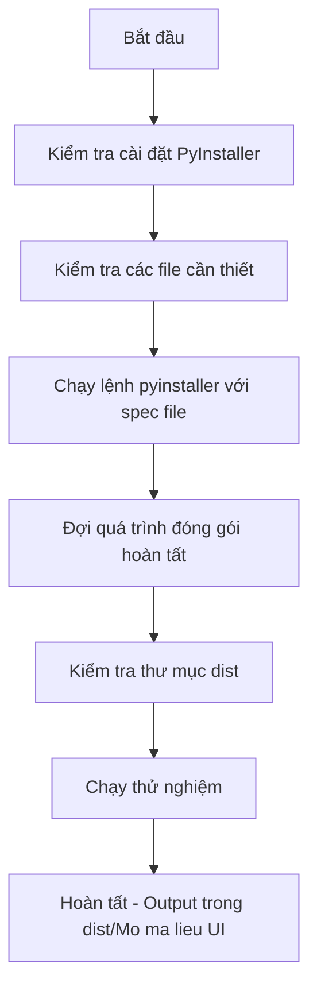

# Hướng dẫn đóng gói OneDir cho Ứng dụng Mở Mã Liệu UI

## Tổng quan

Tài liệu này hướng dẫn cách đóng gói ứng dụng thành **OneDir** (single directory distribution) sử dụng PyInstaller.

## Cấu trúc Project Hiện Tại

```
Tool open/
├── Mở mã liệu UI.py          # File giao diện chính (entry point)
├── Mở mã liệu 打开链接VP.py   # Module core xử lý logic
├── updater.py                # Module update tự động
├── version.json              # File phiên bản
├── Mo ma lieu UI.spec        # File cấu hình PyInstaller
├── updates/                  # Thư mục chứa các bản cập nhật
│   └── update_info.json
```

## Các bước đóng gói OneDir

### Bước 1: Cài đặt PyInstaller (nếu chưa có)

**Cách 1: Cài đặt thông qua pip**
```bash
pip install pyinstaller
```

**Cách 2: Nếu pip chưa có trong PATH, sử dụng python -m pip**
```bash
python -m pip install pyinstaller
```

**Cách 3: Kiểm tra xem đã cài chưa**
```bash
pip show pyinstaller
```

**Cách 4: Nếu lỗi vẫn tiếp tục, sử dụng trực tiếp từ Python**
```bash
python -m PyInstaller "Mo ma lieu UI.spec"
```

**Lưu ý quan trọng:**
- PyInstaller cần được cài đặt trong cùng môi trường Python mà bạn đang sử dụng
- Nếu sử dụng virtualenv, cần activate trước khi cài đặt
- Kiểm tra Python đang dùng: `where python`

### Bước 2: Chạy lệnh đóng gói

Sử dụng file spec đã được cấu hình sẵn:

```bash
pyinstaller "Mo ma lieu UI.spec"
```

Hoặc chạy trực tiếp với các tham số:

```bash
pyinstaller --name "Mo ma lieu UI" ^
    --onedir ^
    --console=False ^
    --add-data "Mở mã liệu 打开链接VP.py;." ^
    --add-data "updater.py;." ^
    --add-data "version.json;." ^
    --add-data "updates;updates" ^
    --hidden-import=PySide6 ^
    --hidden-import=PySide6.QtCore ^
    --hidden-import=PySide6.QtGui ^
    --hidden-import=PySide6.QtWidgets ^
    --hidden-import=openpyxl ^
    --hidden-import=requests ^
    --hidden-import=pandas ^
    --hidden-import=pyperclip ^
    --hidden-import=numpy ^
    "Mở mã liệu UI.py"
```

### Bước 3: Kiểm tra thư mục Output

Sau khi đóng gói thành công, thư mục `dist/Mo ma lieu UI/` sẽ chứa:

```
dist/
└── Mo ma lieu UI/
    ├── Mo ma lieu UI.exe      # File thực thi chính
    ├── *.dll                  # Các thư viện DLL
    ├── updates/              # Thư mục updates
    └── (các file khác)
```

### Bước 4: Chạy thử nghiệm

```bash
cd dist/Mo ma lieu UI
./"Mo ma lieu UI.exe"
```

## Giải thích các tùy chọn quan trọng

| Tùy chọn | Giá trị | Ý nghĩa |
|----------|---------|---------|
| `--onedir` | Bắt buộc | Tạo thư mục chứa executable thay vì single file |
| `--console=False` | Không hiện cửa sổ console | Ứng dụng GUI không cần console |
| `--add-data` | Đính kèm file | Đưa các file .py vào package |
| `--hidden-import` | Import ẩn | Khai báo các module import động |

## Cấu hình trong File Spec

File [`Mo ma lieu UI.spec`](Mo%20ma%20lieu%20UI.spec:23) đã được cấu hình:

- Dòng 8: `datas` - khai báo các file cần đóng gói
- Dòng 9: `hiddenimports` - các module import động
- Dòng 23: `exclude_binaries=False` - quan trọng cho OneDir
- Dòng 43: `name='Mo ma lieu UI'` - tên thư mục output

## Lưu ý quan trọng về Update trong OneDir

Khi đóng gói thành OneDir:
- Các file `.py` gốc **KHÔNG** được đóng gói vào trong exe
- Module updater cần xử lý khác cho OneDir (xem [`plans/plan_onedir_update.md`](../plans/plan_onedir_update.md))
- Cần cập nhật toàn bộ thư mục OneDir thay vì từng file `.py`

## Các lỗi thường gặp và cách khắc phục

### Lỗi: Import Error

**Nguyên nhân**: Thiếu hidden-import
**Giải pháp**: Thêm `--hidden-import=tên_module` vào lệnh

### Lỗi: File not found

**Nguyên nhân**: Thiếu add-data cho file cần thiết
**Giải pháp**: Thêm `--add-data "đường_dẫn;nơi_đặt"` vào lệnh

### Lỗi: Application không chạy được

**Nguyên nhân**: Thiếu DLL hoặc Visual C++ Runtime
**Giải pháp**: Cài đặt Visual C++ Redistributable

### Lỗi: File core module không được đóng gói

**Nguyên nhân**: File có tên Unicode có thể không được PyInstaller xử lý đúng
**Giải pháp**: 
1. Kiểm tra thư mục `_internal/` sau khi build
2. Nếu thiếu file `Mở mã liệu 打开链接VP.py`, cần thêm thủ công hoặc đổi tên file không có Unicode

## Quy trình đóng gói hoàn chỉnh


