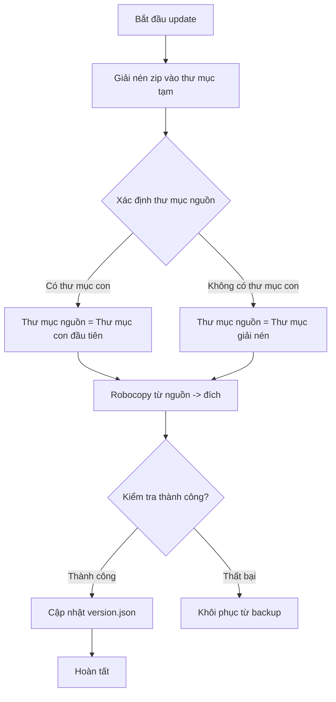

# Kế hoạch: Cập nhật logic Update để sử dụng Robocopy

## 1. Phân tích vấn đề hiện tại

### Cấu trúc file update zip hiện tại:
```
onedir_v1.0.61.zip
├── Mo ma lieu UI\
│   ├── Mo ma lieu UI V61.exe
│   └── _internal\
│       └── (các file internal)
```

### Vấn đề:
- Code hiện tại trong [`updater.py`](updater.py) sử dụng phương thức **di chuyển toàn bộ thư mục** (move folder)
- Người dùng muốn **robocopy từng file** từ thư mục nguồn (sau khi giải nén) đến vị trí app cũ
- Mục tiêu: Giữ nguyên vị trí đặt app hiện tại `C:\Users\Kelly\Desktop\in use 打开料号\Mo maieu UIV1\`

### Yêu cầu cụ thể của người dùng:
- **Nguồn (sau khi giải nén)**: `onedir_v1.0.61.zip\Mo maieu UI\`
- **Đích**: `C:\Users\Kelly\Desktop\in use 打开料号\Mo maieu UIV1\`
- **Kết quả mong đợi**:
  - `C:\Users\Kelly\Desktop\in use 打开料号\Mo maieu UIV1\Mo maieu UI V61.exe` (bản mới)
  - `C:\Users\Kelly\Desktop\in use 打开料号\Mo maieu UIV1\_internal` (bản mới)

---

## 2. Giải pháp đề xuất

### Thay đổi logic trong hàm `apply_onedir_update()`:

1. **Giải nén zip** như hiện tại
2. **Xác định thư mục nguồn** trong thư mục giải nén (thư mục con đầu tiên)
3. **Sử dụng robocopy** để copy nội dung từ thư mục nguồn vào thư mục đích (onedir_path) thay vì di chuyển cả thư mục
4. **Giữ logic backup** để có thể rollback nếu cần

### Sơ đồ logic mới:



---

## 3. Các bước thực hiện

### Bước 1: Sửa hàm `apply_onedir_update()` trong [`updater.py`](updater.py:342)
- Thay thế logic di chuyển thư mục bằng robocopy copy
- Cập nhật PowerShell script để sử dụng robocopy với tham số `/E /COPYALL /MIR` hoặc `/E`

### Bước 2: Cập nhật PowerShell script
- Thay thế `robocopy /MOVE` bằng `robocopy /E /COPYALL` 
- Giữ nguyên logic backup để rollback nếu cần

### Bước 3: Xử lý đường dẫn
- Đảm bảo đường dẫn nguồn (trong thư mục giải nén) được xác định đúng
- Xử lý trường hợp có hoặc không có thư mục con trong zip

### Bước 4: Test
- Test với file zip mẫu để đảm bảo robocopy hoạt động đúng

---

## 4. Lưu ý quan trọng

1. **Robocopy thay vì Move**: Sử dụng `robocopy` với tham số `/E /COPYALL` để copy tất cả file và thư mục con
2. **Giữ backup**: Vẫn tạo backup nhưng chỉ copy (không move) từ nguồn sang đích
3. **Xử lý Unicode**: Tiếp tục sử dụng PowerShell với UTF-8 BOM để xử lý đường dẫn tiếng Việt
4. **Tương thích ngược**: Đảm bảo vẫn hoạt động với các bản update cũ

---

## 5. Files cần sửa

| File | Hàm cần sửa | Mô tả |
|------|------------|-------|
| [`updater.py`](updater.py:342) | `apply_onedir_update()` | Thay đổi logic từ move folder sang robocopy |
| [`updater.py`](updater.py:504) | PowerShell script | Cập nhật script để sử dụng robocopy copy thay vì move |

---

## 6. Kết quả mong đợi

- ✅ Update hoạt động với robocopy thay vì di chuyển toàn bộ thư mục
- ✅ File mới được copy vào vị trí app cũ: `C:\Users\Kelly\Desktop\in use 打开料号\Mo maieu UIV1\`
- ✅ Giữ nguyên logic backup để rollback nếu cần
- ✅ Xử lý đúng đường dẫn Unicode tiếng Việt
