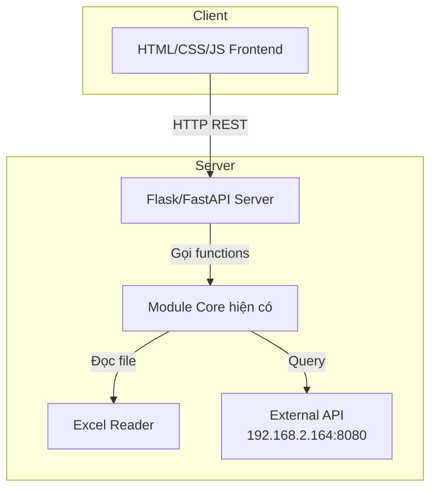

# Kế hoạch: Web App kết nối Python Backend

## 1. Tổng quan dự án

Xây dựng ứng dụng web với giao diện HTML/CSS/JS kết nối với backend Python (Flask/FastAPI) để tận dụng code hiện có từ module core.

## 2. Kiến trúc hệ thống



## 3. Các bước thực hiện

### Bước 1: Tạo Flask/FastAPI Server
- Tạo file `app.py` với Flask/FastAPI
- Import module core hiện có (`Mở mã liệu 打开链接VP.py`)
- Tạo các endpoints:
  - `POST /api/search` - Tìm kiếm mã liệu
  - `GET /api/status` - Kiểm tra kết nối Excel
  - `GET /api/history` - Lấy lịch sử tìm kiếm
  - `POST /api/history` - Lưu lịch sử tìm kiếm
- Xử lý CORS cho frontend

### Bước 2: Tạo giao diện HTML/CSS/JS
- Tạo file `index.html`:
  - Layout 2 cột (điều khiển bên trái, log bên phải)
  - Thanh tìm kiếm với nút Tra cứu
  - Dropdown lịch sử tìm kiếm
  - Danh sách kết quả khi có nhiều matches
  - Panel hiển thị log hoạt động
  - Thanh trạng thái và progress bar
  - Menu bar (Trợ giúp, Kiểm tra cập nhật, Thông tin)

- Tạo file `styles.css`:
  - Theme tối (dark mode) theo phong cách Tokyo Night
  - Responsive layout
  - Hiệu ứng hover và animations

- Tạo file `app.js`:
  - Xử lý sự kiện tìm kiếm (Enter key, button click)
  - Gọi API backend bằng fetch()
  - Cập giao diện theo kết quả trả về
  - Quản lý lịch sử tìm kiếm (localStorage)
  - Xử lý keyboard shortcuts

### Bước 3: Triển khai và Test
- Chạy Flask server: `python app.py`
- Mở browser tại `http://localhost:5000`
- Test các chức năng:
  - Tìm kiếm mã
  - Hiển thị nhiều kết quả
  - Mở thư mục (lưu ý: chỉ hoạt động khi mở từ máy cài Windows)

## 4. Cấu trúc thư mục dự kiến

```
Tool open/
├── app.py                 # Flask/FastAPI server (mới)
├── templates/
│   └── index.html         # Giao diện HTML
├── static/
│   ├── css/
│   │   └── styles.css     # Styles
│   └── js/
│       └── app.js         # JavaScript
├── Mở mã liệu 打开链接VP.py   # Module core (đã có)
├── Mở mã liệu UI.py      # App cũ (giữ nguyên)
└── ...
```

## 5. API Endpoints chi tiết

| Method | Endpoint | Mô tả | Request Body | Response |
|--------|----------|--------|--------------|----------|
| POST | /api/search | Tìm kiếm mã liệu | `{ "code": "PABC123" }` | `{ "type": "success\|multiple\|error", "urls": [...], "matches": [...], "message": "..." }` |
| GET | /api/status | Kiểm tra trạng thái | - | `{ "status": "ready\|loading\|error", "message": "..." }` |
| GET | /api/history | Lấy lịch sử | - | `{ "history": ["code1", "code2", ...] }` |
| POST | /api/history | Lưu lịch sử | `{ "history": ["code1", ...] }` | `{ "success": true }` |

## 6. Lưu ý quan trọng

- **Chức năng mở thư mục**: Do hạn chế của browser, chức năng mở Windows Explorer từ web app sẽ không hoạt động hoàn chỉnh. Giải pháp: Copy đường dẫn vào clipboard để người dùng tự dán vào Explorer.
- **Kết nối mạng**: API backend cần chạy trên cùng mạng nội bộ để truy cập `192.168.2.164:8080` và file Excel trên `192.168.2.165`.
- **Tương thích**: Code Python cần được điều chỉnh để chạy trong thread riêng biệt không block server.
