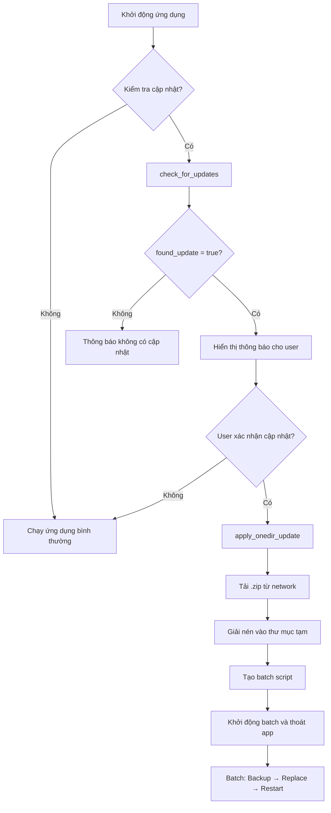
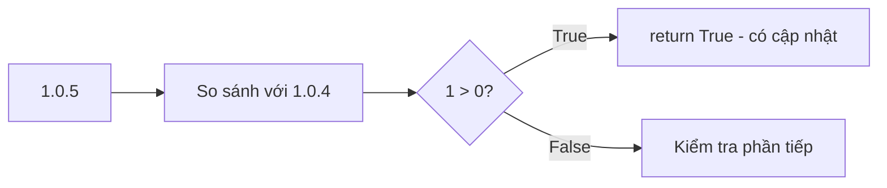

# Tài liệu Logic Updater - Mở mã liệu UI

## 1. Tổng quan hệ thống updater

Hệ thống updater được thiết kế để tự động cập nhật ứng dụng "Mở mã liệu UI" từ network share. Hệ thống hỗ trợ hai loại cập nhật:

- **Onedir Update**: Cập nhật toàn bộ thư mục đã đóng gói (.exe)
- **Py Update**: Cập nhật các file .py (dùng khi chạy source Python)

### Sơ đồ luồng hoạt động



---

## 2. Cấu hình và đường dẫn

### Thông số chính

| Tham số | Giá trị |
|---------|---------|
| APP_NAME | "Mở mã liệu UI" |
| CURRENT_VERSION | "1.0.0" |
| NETWORK_UPDATE_PATH | `\\192.168.2.165\越南vp共享文件夹\13-IT_data\Software\Tool_Open\updates` |

### Các hàm đường dẫn

```python
get_app_path()           # Lấy đường dẫn thư mục chính của ứng dụng
get_onedir_path()        # Lấy đường dẫn thư mục chứa exe (onedir)
get_version_file_path()  # Lấy đường dẫn file version.json
get_state_file_path()    # Lấy đường dẫn file trạng thái cập nhật
```

---

## 3. Quản lý Version

### File version.json (Local)

```json
{
    "app_name": "Mở mã liệu UI",
    "version": "1.0.5",
    "last_check": "2026-03-11 17:42:40"
}
```

### File update_info.json (Network)

```json
{
    "version": "1.0.4",
    "filename": "onedir_v1.0.4.zip",
    "onedir_filename": "onedir_v1.0.4.zip",
    "release_date": "2026-03-11",
    "changelog": "Thêm tính năng chuột phải coppy",
    "force_update": false,
    "update_type": "onedir"
}
```

### Hàm so sánh version

```python
compare_versions(local_ver, remote_ver)
```

Logic so sánh:
1. Loại bỏ prefix "v" và suffix "beta"
2. Tách version thành các phần số (major.minor.patch)
3. So sánh từng phần từ trái sang phải
4. Xử lý đặc biệt: phiên bản beta < phiên bản release



---

## 4. Kiểm tra cập nhật (Check Update)

### Hàm chính: `check_for_updates()`

```
┌─────────────────────────────────────────────────────────────┐
│ check_for_updates()                                        │
├─────────────────────────────────────────────────────────────┤
│ 1. In thông tin version hiện tại và đường dẫn network     │
│ 2. Gọi check_update_from_network()                         │
│ 3. Xử lý kết quả và trả về dict                            │
└─────────────────────────────────────────────────────────────┘
```

### Hàm chi tiết: `check_update_from_network()`

```
┌─────────────────────────────────────────────────────────────┐
│ check_update_from_network()                                │
├─────────────────────────────────────────────────────────────┤
│ Input: None                                                │
│ Output: {                                                  │
│   'found_update': bool,                                    │
│   'update_info': dict or None,                             │
│   'error': str or None                                     │
│ }                                                          │
├─────────────────────────────────────────────────────────────┤
│ 1. Kiểm tra NETWORK_UPDATE_PATH tồn tại                   │
│ 2. Tìm file update_info.json trên network                 │
│ 3. Đọc version từ update_info.json                        │
│ 4. Gọi compare_versions() để so sánh                      │
│ 5. Nếu có version mới → kiểm tra file .zip tồn tại        │
│ 6. Thêm 'download_path' vào update_info                   │
└─────────────────────────────────────────────────────────────┘
```

---

## 5. Cài đặt cập nhật (Apply Update)

### Hàm chính: `apply_onedir_update(zip_path, progress_callback)`

```
┌─────────────────────────────────────────────────────────────┐
│ apply_onedir_update(zip_path, progress_callback)          │
├─────────────────────────────────────────────────────────────┤
│ Bước 1: Tải file .zip từ network về thư mục temp          │
│         - Tạo thư mục temp: %TEMP%\app_update_[timestamp] │
│         - Copy file .zip vào thư mục temp                  │
│                                                          │
│ Bước 2: Giải nén file .zip                                │
│         - Tạo thư mục extracted                           │
│         - Giải nén vào thư mục extracted                  │
│         - Xác định thư mục gốc (bỏ qua thư mục cha nếu có) │
│                                                          │
│ Bước 3: Tạo batch script để thay thế thư mục              │
│         - Tạo đường dẫn backup: [app]_backup_[timestamp]  │
│         - Tạo nội dung batch script                       │
│         - Lưu file apply_update.bat                       │
│                                                          │
│ Bước 4: Trả về True khi sẵn sàng                         │
└─────────────────────────────────────────────────────────────┘
```

### Batch Script Logic

```batch
@echo off
chcp 65001 > NUL
setlocal enabledelayedexpansion

echo Dang doi ung dung dong lai (3 giay)...
timeout /t 3 /nobreak > NUL

echo [1/3] Dang sao luu he thong cu...
move /y "[onedir_path]" "[backup_path]"

echo [2/3] Dang cai dat ban moi...
move /y "[extracted_folder]" "[onedir_path]"

echo [3/3] Hoan tat! Ghi nhan trang thai...
echo {"status": "Success", ...} > "[onedir_path]\update_state.json"

:LaunchAndExit
echo Dang khoi dong lai ung dung...
start "" "[exe_path]"
timeout /t 2 /nobreak > NUL
del "%~f0"
```

---

## 6. Trạng thái cập nhật (State Tracking)

### File: update_state.json

```json
{
    "status": "Success",
    "message": "Update completed successfully",
    "backup_dir": "C:\\...\\Mở mã liệu UI_backup_20260311",
    "timestamp": "2026-03-11 17:45:00"
}
```

### Các trạng thái

| Trạng thái | Mô tả |
|------------|-------|
| "Applying" | Đang chuẩn bị cài đặt qua batch script |
| "Success" | Cập nhật thành công |
| "Failed" | Cập nhật thất bại |

### Hàm quản lý trạng thái

```python
set_update_state(status, message, backup_dir)  # Ghi trạng thái
get_update_state()                               # Đọc trạng thái
clear_update_state()                             # Xóa trạng thái
```

---

## 7. Tạo file cập nhật (Create Update)

### Script: create_update.py

Cung cấp các chế độ tạo cập nhật:

```bash
# Chế độ onedir (đóng gói thư mục .exe)
python create_update.py onedir <path> [version] [changelog]

# Chế độ py (đóng gói các file .py)
python create_update.py py [version] [changelog]

# Chế độ tương tác
python create_update.py
```

### Hàm tạo onedir update

```python
create_onedir_update(onedir_path, new_version, changelog, output_folder)
```

Quy trình:
1. Kiểm tra thư mục onedir tồn tại
2. Lấy version hiện tại hoặc tự động tăng
3. Tạo file .zip chứa toàn bộ thư mục onedir
4. Tạo file update_info.json với metadata

---

## 8. Cấu trúc thư mục network

```
\\192.168.2.165\越南vp共享文件夹\13-IT_data\Software\Tool_Open\updates\
├── update_info.json          # Thông tin phiên bản mới nhất
├── onedir_v1.0.4.zip         # File cập nhật onedir
├── onedir_v1.0.3.zip         # Các phiên bản cũ
└── ...
```

---

## 9. Xử lý khởi động lại ứng dụng

### Hàm: `restart_application()`

```
┌─────────────────────────────────────────────────────────────┐
│ restart_application()                                      │
├─────────────────────────────────────────────────────────────┤
│ 1. Xóa các file .pyc trong thư mục app                    │
│ 2. Kiểm tra batch script đã được tạo chưa                  │
│ 3. Nếu có batch script:                                     │
│    - Chạy batch với DETACHED_PROCESS                       │
│    - Thoát ứng dụng hiện tại                               │
│ 4. Nếu không có batch script:                              │
│    - Khởi động lại .exe hoặc .py thông thường             │
└─────────────────────────────────────────────────────────────┘
```

---

## 10. Các hàm tiện ích

| Hàm | Mô tả |
|-----|-------|
| `load_local_version()` | Đọc version từ file local |
| `save_local_version(version)` | Lưu version vào file local |
| `compare_versions(local, remote)` | So sánh hai version string |

---

## 11. Error Handling

Các lỗi có thể xảy ra và cách xử lý:

| Lỗi | Nguyên nhân | Giải pháp |
|-----|-------------|-----------|
| "Đường dẫn cập nhật mạng chưa được cấu hình" | NETWORK_UPDATE_PATH = None | Kiểm tra cấu hình |
| "Không thể truy cập đường dẫn mạng" | Network path không tồn tại | Kiểm tra quyền truy cập |
| "Không tìm thấy file update_info.json" | File không có trên network | Upload file lên network |
| "Không tìm thấy file cập nhật" | File .zip không tồn tại | Kiểm tra tên file trong update_info.json |
| "Lỗi giải nén .zip" | File .zip corrupted | Tạo lại file .zip |
| "Failed to backup old directory" | Thư mục bị khóa bởi process khác | Đóng ứng dụng khác |

---

## 12. Progress Callback

Hàm `apply_onedir_update()` hỗ trợ callback để hiển thị tiến trình:

```python
def progress_callback(percent, message):
    print(f"Progress: {percent}% - {message}")

apply_onedir_update(zip_path, progress_callback)
```

Tiến trình:
- 10%: Đang tải bản cập nhật
- 30%: Đang giải nén tập tin
- 60%: Đang chuẩn bị cập nhật
- 100%: Sẵn sàng cập nhật
