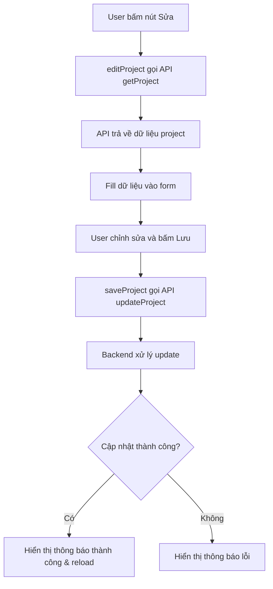

# Kế hoạch hoàn thiện tính năng chỉnh sửa dự án (Edit Project)

## Tổng quan
Tính năng chỉnh sửa dự án (Edit Project) đã có cơ bản nhưng còn một số vấn đề cần khắc phục để hoạt động hoàn chỉnh.

## Các vấn đề phát hiện

### 1. Frontend - Hàm editProject() (projects.js:946-971)
**Vấn đề**: Dùng vòng lặp để fill data nhưng key trong JSON response không khớp với ID field trong form.

| JSON Key | Field ID (Form) |
|----------|-----------------|
| "Mã bản vẽ KT" | field-mabavkythuat |
| "Mã mẹ" | field-mame |
| "TG mong muốn" | field-tg-mongmuon |
| "TG hoàn thành" | field-tg-hoanthanh |
| "Độ khẩn" | field-capbach |

**Giải pháp**: Thay vì dùng vòng lặp tự động, fill thủ công từng field.

### 2. Frontend - Hàm saveProject() (projects.js:1033-1095)
**Vấn đề**: 
- Thu thập dữ liệu từ form đúng nhưng cần thêm validation
- Mapping key gửi sang backend cần khớp với backend expectations

### 3. Backend - API PUT /api/projects/<id> (unified_server.py:1103-1112)
**Đã hoạt động**: Gọi `update_record()` trong db_helper.py

### 4. Backend - Hàm update_record() (db_helper.py:867-962)
**Đã hoạt động**: Có column mapping đầy đủ

## Kế hoạch thực hiện

### Bước 1: Sửa hàm editProject() trong projects.js
- Fill thủ công từng field thay vì dùng vòng lặp
- Đảm bảo đúng mapping từ JSON response sang form fields

### Bước 2: Cải thiện hàm saveProject() 
- Thêm validation cho các trường bắt buộc
- Cải thiện xử lý lỗi

### Bước 3: Test workflow
- Test toàn bộ quy trình edit project

## Mermaid Flow

## File cần chỉnh sửa
- `web/js/modules/projects.js` - Hàm editProject() và saveProject()