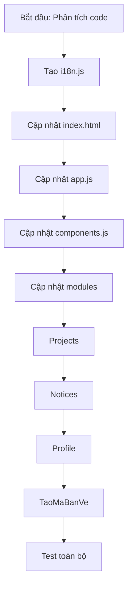

# Kế hoạch Hoàn thiện Web Tiếng Trung và Tiếng Việt

## Tổng quan
Project web quản lý dự án Propack VP đã có hệ thống translations trong module `taomabanve.js`. Cần mở rộng và hoàn thiện để toàn bộ ứng dụng hỗ trợ đa ngôn ngữ.

## Các file cần chỉnh sửa

### 1. Tạo file i18n tập trung
- **File mới**: `web/js/i18n.js`
- **Nội dung**: Hệ thống translations tập trung với tất cả labels, messages, buttons

### 2. Cập nhật `web/js/components.js`
- Thêm translations cho các hàm dùng chung
- Toast messages, pagination, empty states, loading states

### 3. Cập nhật `web/js/app.js`
- Login modal: labels, buttons, error messages
- Navigation: tab names, labels
- Logout confirm
- Submit feedback modal

### 4. Cập nhật `web/js/modules/projects.js`
- Toolbar: buttons, filters, search placeholders
- Table headers
- Modal: labels, buttons
- Pagination
- Toast messages

### 5. Cập nhật `web/js/modules/notices.js`
- Toolbar: buttons, filters, search placeholders
- Stats badges
- Table headers
- Modal: labels, buttons
- Pagination
- Toast messages

### 6. Cập nhật `web/js/modules/profile.js`
- Profile form labels
- Password change modal
- Toast messages

### 7. Cập nhật `web/js/modules/taomabanve.js`
- Hoàn thiện phần translations còn thiếu
- Đảm bảo state language đồng bộ với global i18n

### 8. Cập nhật `web/index.html`
- Thêm language selector trong header
- Static HTML labels sang tiếng Việt và Trung
- Data attributes cho i18n

### 9. Cập nhật `web/css/style.css`
- CSS cho language selector buttons
- Hover/active states

## Thứ tự thực hiện

```
1. Tạo web/js/i18n.js (hệ thống translations tập trung)
2. Cập nhật web/js/app.js (entry point - load i18n)
3. Cập nhật web/index.html (thêm language selector)
4. Cập nhật web/js/components.js (dùng từ i18n)
5. Cập nhật từng modules theo thứ tự:
   - projects.js
   - notices.js
   - profile.js
   - taomabanve.js
6. Kiểm tra và test
```

## Mermaid: Workflow


