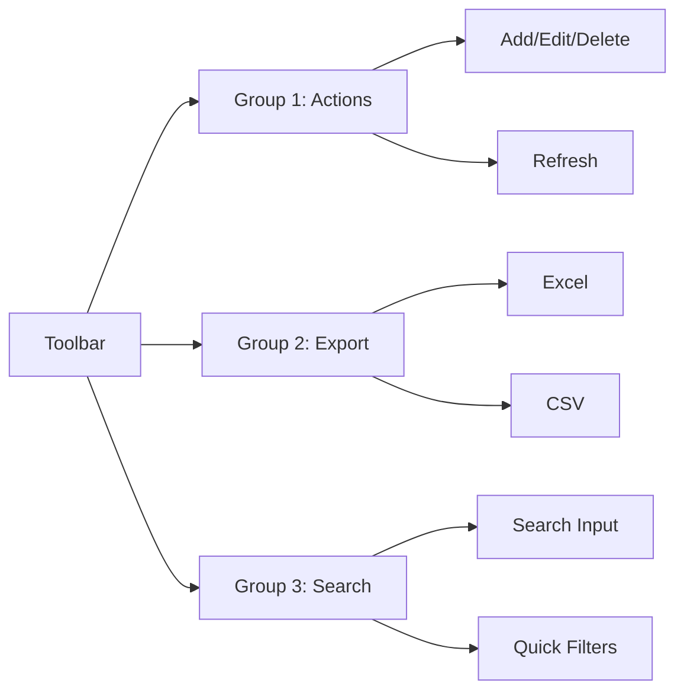

# Kế hoạch tối ưu hóa giao diện Projects

## 1. Phân tích vấn đề hiện tại

### Vấn đề đã xác định:
1. **Toolbar**: 
   - Quá nhiều nút (7 nút) trên một hàng → gây rối mắt
   - Thiếu nhóm chức năng rõ ràng
   
2. **Table**:
   - 22 cột → quá rộng, khó xem
   - Không có tính năng ẩn/hiện cột
   - Thiếu cột cố định (sticky column)
   
3. **Search**:
   - Chỉ có một ô text input
   - Thiếu bộ lọc nhanh theo trạng thái, độ khẩn
   
4. **Modal Form**:
   - 22 trường trong một modal → quá nhiều
   - Thiếu validation
   - Thiếu wizard/step form
   
5. **UX**:
   - Loading states chưa tốt
   - Empty states đơn giản
   - Thiếu animations mượt

---

## 2. Các cải tiến cần thực hiện

### A. Tối ưu Toolbar

**Thay đổi:**
- Nhóm nút thành 3 nhóm: Thao tác | Xuất | Tìm kiếm
- Thêm dropdown menu cho các nút ít dùng
- Thêm icon + tooltip cho các nút

### B. Cải thiện Table
**Thay đổi:**
- Thêm nút "Cột" để ẩn/hiện cột
- Cố định 3 cột đầu: Checkbox, STT, Tracking ID
- Thêm quick action menu (3 chấm) cho mỗi dòng
- Thêm status indicator trực quan

### C. Nâng cao Search & Filter
**Thay đổi:**
- Thêm dropdown lọc theo: Trạng thái, Độ khẩn, Khách hàng
- Thêm date range picker
- Tìm kiếm theo nhiều trường cùng lúc
- Lưu bộ lọc gần nhất

### D. Cải thiện Modal Form
**Thay đổi:**
- Chia form thành 3 tab: Thông tin cơ bản | Sản phẩm | Kỹ thuật
- Thêm validation với visual feedback
- Thêm auto-save draft
- Thêm keyboard shortcuts

### E. UX Improvements
**Thay đổi:**
- Skeleton loading states
- Smooth transitions/animations
- Toast notifications tốt hơn
- Keyboard navigation

---

## 3. Thứ tự ưu tiên

| Priority | Item | Description |
|----------|------|-------------|
| P1 | Quick Filters | Thêm bộ lọc nhanh dropdown |
| P1 | Column Toggle | Cho phép ẩn/hiện cột |
| P1 | Quick Actions | Menu 3 chấm cho mỗi dòng |
| P2 | Toolbar Groups | Nhóm nút toolbar |
| P2 | Form Tabs | Chia modal form thành tabs |
| P3 | Advanced Search | Tìm kiếm nâng cao |
| P3 | Keyboard Shortcuts | Phím tắt |

---

## 4. Files cần thay đổi

1. `web/js/modules/projects.js` - Logic JS
2. `web/css/style.css` - Styles
3. `web/app.html` - HTML structure (nếu cần)