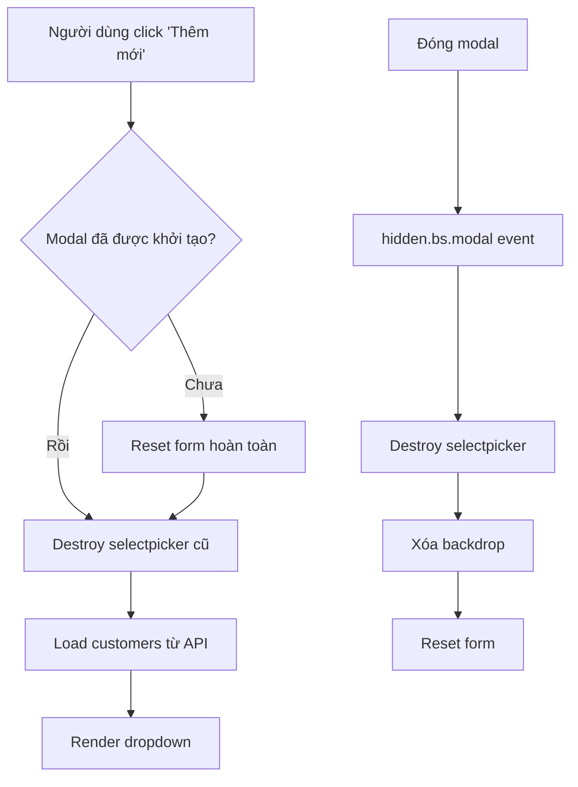

# Kế hoạch sửa lỗi giao diện Modal Project

## Vấn đề hiện tại
Khi tạo nhiều project liên tục, giao diện modal bị lỗi:
- Dữ liệu khách hàng cũ không được xóa
- Dropdown chọn khách hàng bị lỗi, không hiển thị đúng
- Modal không reset hoàn toàn giữa các lần mở

## Nguyên nhân gốc rễ

### 1. Modal không được cleanup khi đóng
- **Vị trí**: [`showProjectModal()`](web/js/modules/projects.js:1120)
- **Vấn đề**: Khi modal đóng, không có event listener `hidden.bs.modal` để dọn dẹp trạng thái
- **Hậu quả**: Các listener cũ vẫn còn hoạt động, selectpicker không được destroy đúng cách

### 2. Selectpicker không được reset hoàn toàn
- **Vị trí**: Logic trong [`showProjectModal()`](web/js/modules/projects.js:1126-1197)
- **Vấn đề**: Mặc dù có logic destroy nhưng có thể không hoàn toàn sạch
- **Hậu quả**: Khi mở modal lần thứ 2, dropdown hiển thị dữ liệu cũ

### 3. Modal backdrop không được xóa
- **Vấn đề**: Bootstrap modal backdrop vẫn còn sau khi đóng modal
- **Hậu quả**: Giao diện bị che, không thể tương tác với các phần tử khác

## Kế hoạch khắc phục

### Bước 1: Thêm event listener cho hidden.bs.modal
- Thêm event listener để cleanup khi modal đóng hoàn toàn
- Reset form, destroy selectpicker, xóa backdrop

### Bước 2: Cải thiện showProjectModal()
- Đảm bảo reset hoàn toàn trước khi load dữ liệu mới
- Sử dụng cách tiếp cận nhất quán cho selectpicker

### Bước 3: Thêm xử lý backdrop
- Xóa modal-backdrop thủ công nếu còn sót lại
- Đảm bảo body không bị lock sau khi đóng modal

## Sơ đồ luồng xử lý

## File cần chỉnh sửa
- [`web/js/modules/projects.js`](web/js/modules/projects.js)

## Thứ tự thực hiện
1. Thêm `hidden.bs.modal` event listener trong `renderProjectsContent()`
2. Sửa `showProjectModal()` để đảm bảo reset hoàn toàn
3. Thêm cleanup cho backdrop và body state

## Kiểm tra sau khi sửa
- [ ] Tạo 3 project liên tục, mỗi lần modal hiển thị đúng dữ liệu mới
- [ ] Dropdown khách hàng hiển thị đầy đủ danh sách
- [ ] Không có backdrop sót lại sau khi đóng modal
- [ ] Form được reset hoàn toàn sau mỗi lần đóng
