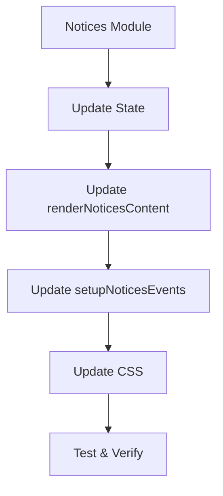

# Kế hoạch đồng bộ hóa UI Notices với Projects

## Mục tiêu
Đồng bộ giao diện UI của trang http://vp.sunqit.cn:8001/app.html#notices để thống nhất với trang http://vp.sunqit.cn:8001/app.html#projects

## Phân tích so sánh

### Projects (UI chuẩn)
- ✅ Toolbar với các nút: Thêm, Sửa, Xóa, Làm mới, Chọn cột, Xuất Excel/CSV
- ✅ Bộ lọc: Trạng thái, Độ khẩn, Tìm kiếm
- ✅ Table với: Checkbox, STT, Tracking ID, và nhiều cột khác
- ✅ Quick actions dropdown (Xem, Sửa, Xóa)
- ✅ Pagination: Hiển thị số bản ghi + Jump to page
- ✅ Modals: Add/Edit, View Detail, Confirm Delete

### Notices (UI hiện tại)
- ⚠️ Chỉ có bộ lọc: Trạng thái, Độ khẩn, Tìm kiếm
- ⚠️ Table không có checkbox chọn lựa
- ⚠️ Không có nút Thêm/Sửa/Xóa
- ⚠️ Không có pagination với Jump to page
- ⚠️ Chỉ có View Detail modal
- ⚠️ Không có Xuất Excel/CSV

## Các bước thực hiện

### Bước 1: Cập nhật State trong notices.js
Thêm các thuộc tính mới:
- selectedIds: Array
- currentPage: Number
- pageSize: Number
- totalRecords: Number
- totalPages: Number
- visibleColumns: Object
- columnsConfig: Array

### Bước 2: Cập nhật renderNoticesContent()
Cập nhật toolbar:
- Thêm nhóm nút: Thêm, Sửa, Xóa
- Thêm nút Làm mới, Chọn cột
- Thêm dropdown Xuất Excel/CSV
- Giữ nguyên bộ lọc hiện tại

Cập nhật table:
- Thêm cột checkbox
- Thêm cột STT
- Thêm cột Hành động với dropdown

Cập nhật pagination:
- Thêm hiển thị "Hiển thị X - Y của Z bản ghi"
- Thêm Jump to page
- Giữ nguyên page size selector

Thêm modals:
- Add/Edit Modal
- Confirm Delete Modal

### Bước 3: Cập nhật setupNoticesEvents()
- Thêm event handlers cho nút Thêm/Sửa/Xóa
- Thêm event handlers cho checkbox
- Thêm event handlers cho pagination
- Thêm event handlers cho export
- Thêm event handlers cho column selector

### Bước 4: Cập nhật CSS
- Thêm styles cho notices table tương tự projects
- Đảm bảo sticky columns hoạt động
- Thêm styles cho column selector popup

### Bước 5: Thêm các hàm CRUD
- saveNotice()
- deleteSelectedNotices()
- exportToExcel()
- exportToCSV()
- updateToolbarState()
- updatePagination()

## Mermaid - Workflow

## Kết quả mong đợi
- Giao diện Notices sẽ có toolbar đầy đủ như Projects
- Có chức năng chọn nhiều dòng, xóa hàng loạt
- Có pagination với Jump to page
- Có chức năng xuất Excel/CSV
- Thống nhất style với Projects