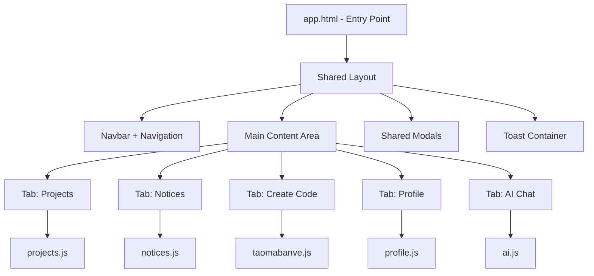

# Kế hoạch tối ưu hóa Web Frontend - Thống nhất sử dụng chung Layout

## 📋 Tổng quan vấn đề

**Hiện trạng:** 5 file HTML riêng biệt có cấu trúc lặp lại:
- `ai.html` - Trang chat AI
- `index.html` - Trang chính (quản lý dự án)
- `notices.html` - Trang thông báo
- `profile.html` - Trang hồ sơ
- `taomabanve.html` - Trang tạo mã bản vẽ

**Vấn đề:**
- Lặp lại cấu trúc HTML (navbar, toast, modal, footer)
- Khó quản lý và bảo trì
- Không nhất quán về UI

---

## 🎯 Mục tiêu

Thống nhất 5 trang thành 1 ứng dụng SPA (Single Page Application) với:
1. **Shared Layout:** Header, Navigation, Footer chung
2. **Shared Components:** Modal, Toast, Loading chung
3. **Tab-based Navigation:** Chuyển đổi giữa các trang không cần tải lại
4. **Lazy Loading:** Tải JS theo từng module khi cần

---

## 🔄 Kiến trúc đề xuất



---

## 📦 Cấu trúc file mới

### Trước:
```
web/
├── index.html       (500 lines)
├── ai.html         (1191 lines)
├── notices.html    (257 lines)
├── profile.html    (304 lines)
├── taomabanve.html (1403 lines)
├── css/style.css   (1453 lines)
└── js/
    ├── api.js      (679 lines)
    ├── app.js
    ├── notices.js
    ├── profile.js
    └── (inline JS in each HTML)
```

### Sau:
```
web/
├── app.html        (≈200 lines - Entry point)
├── css/
│   └── style.css   (giữ nguyên, bổ sung theming)
└── js/
    ├── api.js      (giữ nguyên)
    ├── app.js      (≈100 lines - Router + init)
    ├── components.js (≈150 lines - Shared components)
    └── modules/
        ├── projects.js
        ├── notices.js
        ├── taomabanve.js
        ├── profile.js
        └── ai.js
```

---

## 📝 Các bước thực hiện

### Bước 1: Tạo Shared Components Module
- [ ] Tạo `components.js` chứa:
  - Toast notifications (hiện có trong mỗi file)
  - Modal templates (login, confirm delete, view detail)
  - Loading spinner functions
  - Utility functions (showToast, showLoading, hideLoading)

### Bước 2: Tạo Router/Navigation System
- [ ] Tạo `app.js` với:
  - Tab navigation logic
  - URL hash-based routing (#projects, #notices, #taomabanve, #profile, #ai)
  - Active tab state management
  - Authentication check on route change

### Bước 3: Tạo Layout Template
- [ ] Tạo `app.html` với:
  - Fixed navbar với nav links cho all tabs
  - Tab content containers cho mỗi trang
  - Shared modal placeholders
  - Toast container

### Bước 4: Chuyển đổi từng module
- [ ] **Projects Module:** Tách logic từ index.html → projects.js
- [ ] **Notices Module:** Tách logic từ notices.html → notices.js  
- [ ] **Create Code Module:** Tách logic từ taomabanve.html → taomabanve.js
- [ ] **Profile Module:** Tách logic từ profile.html → profile.js
- [ ] **AI Module:** Tách logic từ ai.html → ai.js

### Bước 5: Cập nhật CSS
- [ ] Thêm tab navigation styles
- [ ] Thêm module-specific styles
- [ ] Đảm bảo responsive cho all views

---

## 🔑 Lợi ích sau tối ưu

| Tiêu chí | Trước | Sau |
|----------|-------|-----|
| Số file HTML | 5 | 1 |
| Dòng code trùng lặp | ~2000+ | ~200 |
| Bảo trì | Khó | Dễ |
| Thêm feature mới | Copy code | Viết module |
| UI nhất quán | Không | Có |

---

## ⏱️ Ước tính công việc

1. **Shared Components:** 1-2 giờ
2. **Router System:** 1 giờ  
3. **Layout Template:** 1 giờ
4. **Module Migration (5 modules):** 4-5 giờ
5. **Testing & Fix:** 2-3 giờ

**Tổng:** ~10 giờ (chia làm nhiều lần thực hiện)

---

## ⚠️ Lưu ý quan trọng

1. **Giữ backward compatibility:** Test từng module trước khi deploy
2. **API không đổi:** Không cần sửa backend
3. **Session management:** Giữ nguyên cơ chế login/logout
4. **Mobile responsive:** Đảm bảo all features work trên mobile
5. **Progressive migration:** Có thể chạy song song old/new trong giai đoạn test

---

## 🚀 Bắt đầu

Sau khi approve kế hoạch này, tôi sẽ tiến hành:
1. Tạo `app.html` - Entry point mới
2. Tạo `js/components.js` - Shared components
3. Tạo `js/app.js` - Router và initialization

Bạn có muốn tôi tiến hành bước đầu tiên không?