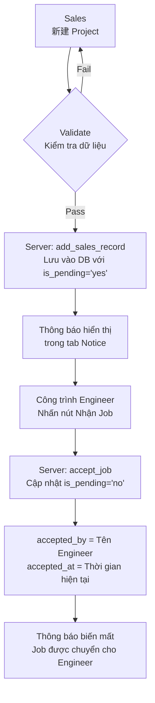

# Workflow: Sales tạo Project → Engineer nhận Job

## Mô tả workflow

Dự án bắt đầu từ bên Sales, họ tạo một dự án mới. Bên tiếp nhận phương án là Công trình Engineer, họ sẽ tiếp nhận và điền mã bản vẽ phương án.

---

## Sơ đồ workflow



---

## Chi tiết từng bước

### Bước 1: Sales tạo Project mới (新建)

Sales nhấn nút **新建** và điền các thông tin sau:

| Trường dữ liệu | Mô tả |
|---|---|
| Tracking ID | Tự động sinh (AUTO) |
| 创建日期 (Ngày tạo) | Ngày giờ hiện tại |
| 客户公司名称 (Tên khách hàng) | Bắt buộc |
| 业务员 (Nhân viên kinh doanh) | Tự động lấy từ session |
| 产品名称 (Tên sản phẩm) | Bắt buộc |
| 规格 (Quy cách) | Tùy chọn |
| 客户联系人 (Người liên hệ) | Bắt buộc |
| 数量 (Số lượng) | Tùy chọn |
| PO号 (Mã PO) | Tùy chọn |
| # 方案图号 (Mã bản vẽ phương án) | Tùy chọn | (khi sales tạo mới chưa cần điền, ẩn tùy chọn này)
| # 图纸编码 (Mã bản vẽ) | Tùy chọn | (khi sales tạo mới chưa cần điền, ẩn tùy chọn này)
| # 母料号 (Mã mẹ) | Tùy chọn | (khi sales tạo mới chưa cần điền, ẩn tùy chọn này)
| 产品类型 (Loại sản phẩm) | Tùy chọn |
    loại sản phẩm có dropdown 
        SJT散件图 - Bản vẽ tách chi tiết
        WLJ物料架 - Giá đựng vật liệu
        ZZC周转车 - Xe trung chuyển
        GZT工作台 - Bàn thao tác
        WCP无尘棚 - Phòng sạch
        LSX流水线 - Băng tải
        ZWJ转弯机 - Băng tải chuyển hướng 90,180
        GZL改造类 - Cải tạo
        BSX倍速线 - Băng chuyền xích
        WLL围栏类 - Hàng rào
        GTX滚筒线 - Băng chuyền con lăn
        ZHT展会图 - Bản vẽ mặt bằng
        LHX老化线 - Băng chuyền lão hóa
| 紧急程度 (Mức độ khẩn cấp) | normal/urgent/very_urgent

### Bước 2: Lưu vào Database

Khi Sales nhấn **Lưu**, hệ thống thực hiện:

1. Gọi API `ADD_SALES_RECORD` → `add_sales_record()` trong `db_helper.py`
2. Record được lưu vào bảng `projects` với:
   - `is_pending = 'yes'` (trạng thái chờ nhận)
   - `user_id` = ID của Sales tạo
3. Trả về kết quả thành công cho Sales

### Bước 3: Hiển thị thông báo

- Job mới xuất hiện trong tab **Notice** / **Thông báo**
- Chỉ hiển thị các record có `is_pending = 'yes'`
- Sales thấy tất cả job đang chờ (sửa đổi)
- Engineer thấy tất cả job đang chờ

### Bước 4: Engineer nhận Job

Engineer thực hiện:

1. Xem danh sách job trong tab **Notice**
2. Nhấn nút **Nhận Job** / **接受任务**
3. Hệ thống gọi API `ACCEPT_JOB` → `accept_job()` trong `db_helper.py`

### Bước 5: Cập nhật Database

Hàm `accept_job()` thực hiện:

```python
UPDATE projects 
SET is_pending = 'no', 
    accepted_by = <tên engineer>, 
    accepted_at = <thời gian hiện tại>
WHERE tracking_id = ? AND is_pending = 'yes'
```

- `is_pending` chuyển từ `'yes'` sang `'no'`
- `accepted_by` = tên engineer bấm nhận
- `accepted_at` = thời gian ISO hiện tại

### Bước 6: Hoàn tất

- Job biến mất khỏi danh sách thông báo chờ
- Job được chuyển vào danh sách của Engineer
- Sales không còn thấy job này trong tab Notice

---

## Database Schema (bảng projects)

```sql
-- Các cột quan trọng cho workflow
projects (
    tracking_id INTEGER PRIMARY KEY,
    Created_Date DATE,
    khach_hang VARCHAR(200),
    nhan_vien_kinh_doanh VARCHAR(100),
    ten_san_pham VARCHAR(200),
    quy_cach TEXT,
    nguoi_lien_he_kh VARCHAR(100),
    so_luong INTEGER,
    ma_po VARCHAR(50),
    ma_ban_ve VARCHAR(50),
    ma_me VARCHAR(50),
    loai_san_pham VARCHAR(100),
    sales_name VARCHAR(100),
    user_id INTEGER,
    is_pending VARCHAR(10) DEFAULT 'no',  -- 'yes' = chờ nhận, 'no' = đã nhận
    accepted_by VARCHAR(100),              -- Người nhận job
    accepted_at TEXT,                     -- Thời gian nhận
    urgency_level VARCHAR(20)             -- Mức độ khẩn cấp
)
```

---

## API Endpoints

| API | Method | Mô tả |
|---|---|---|
| `/api/socket` | POST | Socket API - `ADD_SALES_RECORD` |
| `/api/notices/pending` | GET | Lấy danh sách job chờ (`is_pending = 'yes'`) |
| `/api/notices/accept` | POST | Engineer nhận job |
| `/api/projects` | POST | Thêm project mới |

---

## User Roles và Permissions

| Role | Quyền |
|---|---|
| Sales | `create_sales_record`, `view_history` |
| Engineer | `job_accept`, `view_history` |
| Admin | Tất cả quyền |

---

## Files liên quan

- `src/db_helper.py` - Database helper với `add_sales_record()`, `accept_job()`
- `server.py` - Server xử lý API
- `web/js/notices.js` - Frontend xử lý hiển thị notice và nút nhận job
-

ưu tiên phát triển website, tạm dừng phát triển desktop app

---

## Vietnamese / Tiếng Việt

### Tóm tắt workflow

1. **Sales** tạo project mới → `is_pending = 'yes'`
2. Project hiện trong **tab Notice** (thông báo chờ)
3. **Engineer** nhấn nút **Nhận Job**
4. Hệ thống cập nhật:
   - `is_pending` = `'no'`
   - `accepted_by` = tên engineer
   - `accepted_at` = thời gian nhận
5. Job biến khỏi danh sách chờ, được chuyển cho Engineer

---

## Chinese / 中文

### 工作流程摘要

1. **Sales** 创建新项目 → `is_pending = 'yes'`
2. 项目显示在**通知**标签页（待处理）
3. **工程师** 点击**接受任务**按钮
4. 系统更新：
   - `is_pending` = `'no'`
   - `accepted_by` = 工程师姓名
   - `accepted_at` = 接受时间
5. 项目从待处理列表消失，转给工程师